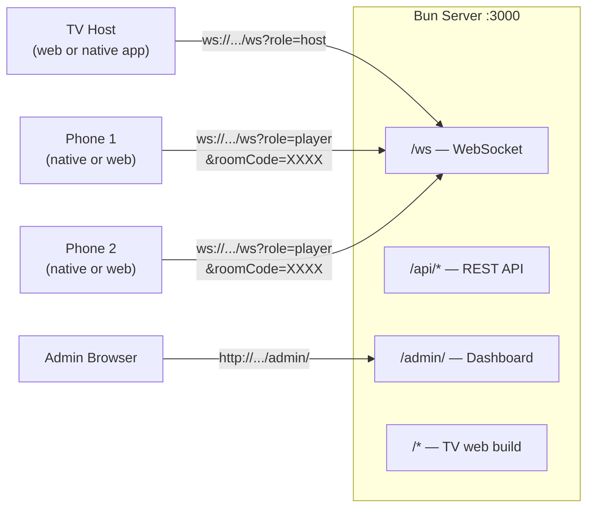
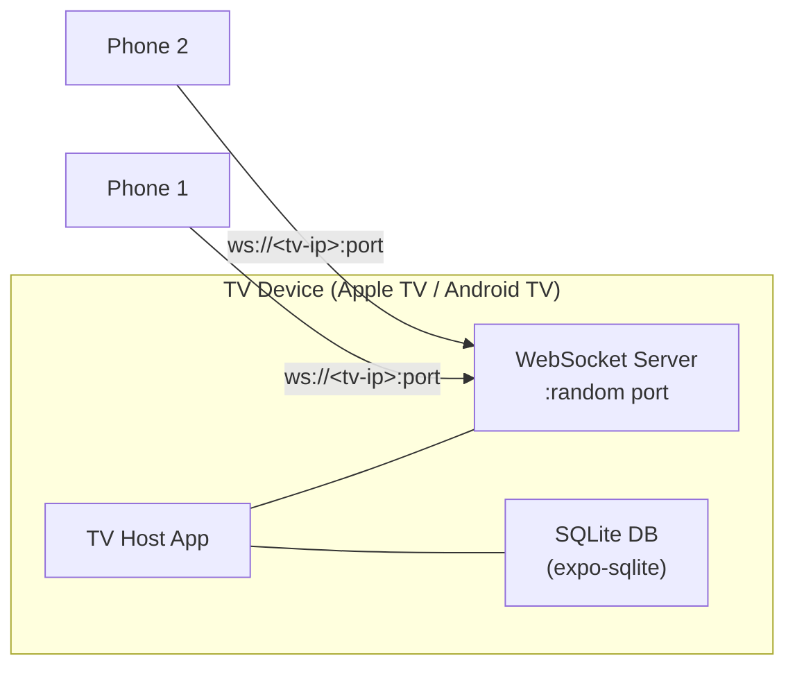
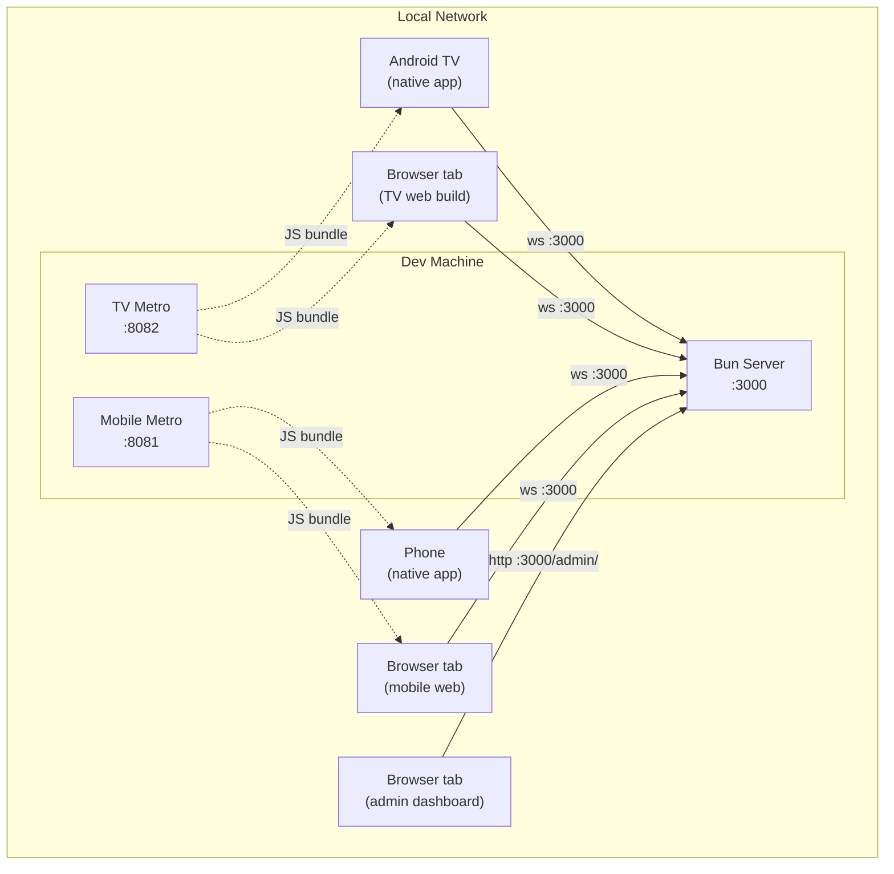

# Unfair Enough!

A multiplayer quiz game where a TV acts as the host display and phones are player controllers. Supports two modes:

- **Local mode** — The TV app runs a WebSocket server directly on the device via TCP sockets. Phones connect over the local network. No external server needed.
- **Hosted mode** — A Bun server manages game rooms. The TV connects as a "host" client, phones connect as players. The server also serves the TV web build, so you can run everything from a single process.

## Prerequisites

- Node >= 24 (see `.nvmrc` for exact version)
- [Bun](https://bun.sh) (for the server)
- Yarn 1 (`npm install -g yarn`)
- Xcode / Android Studio if building native apps
- [Expo CLI](https://docs.expo.dev/get-started/installation/)

## Setup

```bash
git clone <repo-url>
cd UnfairEnough
yarn
```

All packages are consumed as TypeScript source — there's no build step for shared packages.

## Architecture Diagrams

### Hosted mode

The Bun server is the central hub. It manages game rooms, serves the TV web build, the admin dashboard, and a REST API. The TV connects as a "host" client, phones connect as players. Everything goes through port 3000.



The server creates a room when the host connects and returns a 4-character room code. Players join by entering that code (or scanning the QR shown on TV).

When running in development, each app has its own Metro bundler:

| Process | Default port | Notes |
|---------|-------------|-------|
| Bun server | `:3000` | WebSocket, REST API, admin dashboard, static files |
| TV Metro bundler | `:8082` | Expo dev server for tv-host (always 8082 to avoid conflicts) |
| Mobile Metro bundler | `:8081` | Expo dev server for mobile (Expo default) |

### Local mode

No server needed. The TV app itself runs a WebSocket server directly on the device using `react-native-tcp-socket`. The OS assigns a random available port.



Players connect to the TV's local IP address and port, shown on screen (along with a QR code). No admin dashboard is available in local mode — question sets are imported through the TV host UI.

### Full hosted setup (example)

A typical development session with all components running:



## Running in Hosted Mode

This is the easiest way to get everything running. You need two terminals:

```bash
# Terminal 1 — Start the server (port 3000)
yarn dev:server

# Terminal 2 — Start the mobile app (web)
yarn dev:mobile
# then press 'w' to open in browser, or scan the QR code with Expo Go
```

The TV host can also run as a web app pointed at the server:

```bash
# Terminal 3 (optional) — TV host web build
yarn tv web
# Opens on a separate port; connect to the server URL shown in the UI
```

## Running in Local Mode

```bash
# Prebuild native project (required once, or after dependency changes)
EXPO_TV=1 yarn prebuild:tv

# Run on Apple TV / Android TV
yarn tv ios
yarn tv android
```

Players connect to the TV's local IP address, shown on screen (along with a QR code).

## Running the Mobile App Natively

```bash
yarn prebuild:mobile        # Generate native projects
yarn mobile ios             # Run on iOS simulator/device
yarn mobile android         # Run on Android emulator/device
```

## Project Structure

```
apps/
  server/          Bun + Hono server (hosted mode)
  tv-host/         Expo app for Apple TV / Android TV / web (react-native-tvos)
  mobile/          Expo app for phones (iOS / Android / web)

packages/
  ws-protocol/     WebSocket message types and validation
  game-logic/      Redux Toolkit slices, scoring, ranking utils
  db/              SQLite schema, migrations, repositories, YAML import
  ui/              Shared components and "Neon Sakura" theme
  i18n/            i18next translations (English, Italian)
  shared/          Common utilities

questions/         YAML question sets (see question-set.schema.json)
e2e/               Playwright E2E tests (mobile web)
```

## Game Flow

Both the server and the local TV controller follow the same phase machine:

```
LOBBY → COUNTDOWN → [MEDIA_PREVIEW →] QUESTION → REVEALING → RESULTS → ... → GAME_OVER
                     (if question has media)        ↑                      │
                                                    └──────────────────────┘
                                                       next question
```

1. **LOBBY** — Players join, host configures game (casual or from a question set).
2. **COUNTDOWN** — 3-second countdown before the first question.
3. **MEDIA_PREVIEW** — Optional. If a question has attached media (image/audio/video), it's shown on TV before the question text appears.
4. **QUESTION** — Question displayed on all screens. Timer ticks down. Players tap an answer on their phones. Scoring is time-weighted: faster correct answers earn more points.
5. **REVEALING** — Brief pause before showing results.
6. **RESULTS** — Correct answer revealed, per-player scores and rankings shown.
7. **GAME_OVER** — Final leaderboard with position history chart.

## Custom Question Sets

Questions are defined as YAML files in `questions/`. See `questions/example.yaml` for the format, or refer to the JSON schema at `packages/db/question-set.schema.json`.

```yaml
name: "My Quiz"
author: "Your Name"
defaultTimeLimit: 15
tags: [trivia]

questions:
  - id: q1
    text: "What is the capital of France?"
    options:
      - key: A
        text: "London"
      - key: B
        text: "Paris"
      - key: C
        text: "Berlin"
      - key: D
        text: "Madrid"
    correctAnswer: B
```

Question sets can be imported through the TV host UI (Import button on the lobby screen). The TV host also ships with a built-in sample question bank for casual games.

Questions support optional fields: `category`, `tags`, `timeLimit` (per-question override), `explanation`, `playerDifficulty`, and `media` (image/audio/video with a preview duration).

## Key Dev Commands

```bash
yarn dev:server            # Bun server with hot reload (port 3000)
yarn dev:tv                # TV host Metro bundler (sets EXPO_TV=1)
yarn dev:mobile            # Mobile Metro bundler

yarn tv <cmd>              # Run command in tv-host workspace (e.g. yarn tv ios)
yarn mobile <cmd>          # Run command in mobile workspace (e.g. yarn mobile web)

yarn prebuild:tv           # Expo prebuild for TV (EXPO_TV=1)
yarn prebuild:mobile       # Expo prebuild for mobile

yarn server typecheck      # Type-check the server (bun types)

yarn lint                  # Biome lint + format check
yarn lint:fix              # Auto-fix lint + formatting
yarn format                # Auto-fix formatting only

yarn test:e2e              # Playwright E2E tests (headless)
yarn test:e2e:ui           # Playwright with interactive UI
```

## Tech Stack

| Layer | Tech |
|-------|------|
| Server | Bun, Hono, bun:sqlite |
| TV Host | Expo (react-native-tvos), Redux Toolkit, expo-sqlite |
| Mobile | Expo, React Navigation, expo-camera (QR scanning) |
| Shared UI | Custom components, expo-linear-gradient ("Neon Sakura" theme) |
| Protocol | JSON over WebSocket, typed with `@unfairenough/ws-protocol` |
| Database | SQLite (bun:sqlite on server, expo-sqlite on TV) |
| i18n | i18next (EN, IT) |
| Testing | Playwright (mobile web E2E) |
| Linting | Biome (lint + format) |

## Notes

- `EXPO_TV=1` must be set for all tv-host commands — Metro uses `.tv.ts` file extensions.
- Path alias `@unfairenough/*` maps to `packages/*/src`.
- React 19.1.0 is pinned globally via `resolutions`.
- Max 12 players per room.
