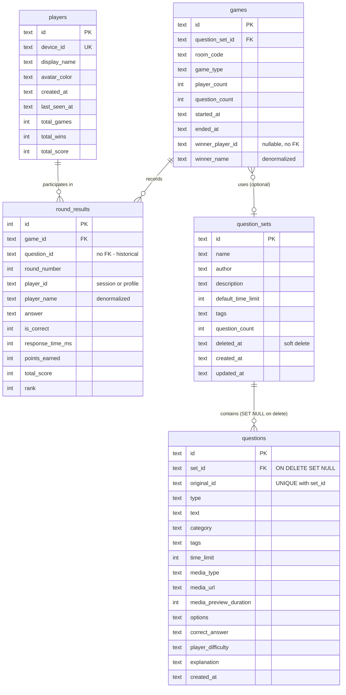

# Adaptive Quiz Engine

## Enhancement Summary

**Deepened on:** 2026-02-06
**Research agents used:** Architecture Strategist, Kieran TypeScript Reviewer, Security Sentinel, Performance Oracle, Code Simplicity Reviewer, Data Integrity Guardian, Pattern Recognition Specialist, Julik Frontend Races Reviewer, Best Practices (bun:sqlite, expo-sqlite, YAML/quiz, SVG charts), Agent-Native Reviewer

### Critical Issues Discovered

1. **Use `yaml` (eemeli) instead of `js-yaml`** — `js-yaml` has CVE-2025-64718 (prototype pollution via merge keys). The `yaml` package by eemeli has built-in `maxAliasCount` protection against YAML bombs.
2. **DbAdapter must be async** — `expo-sqlite` is async; a sync-only interface forces awkward workarounds. Make `DbAdapter` async from the start (return `Promise`), with the `bun:sqlite` adapter wrapping sync calls in resolved promises.
3. **CASCADE deletes destroy historical data** — `ON DELETE CASCADE` on `round_results → games` and `question_stats → questions` will destroy game history when sets are deleted. Use soft-delete or `SET NULL` for the FK on `questions.set_id`.
4. **10 race conditions identified in proposed changes** — especially around MEDIA_PREVIEW timers, uncancellable `setTimeout` in GameController, and AsyncStorage deviceId vs JOIN timing.
5. **Dual orchestration (GameRoom + GameController) is the biggest architectural risk** — both implement the same game flow independently. This plan adds complexity to both. Extract a shared `GameOrchestrator` or at least a shared state machine.
6. **Unauthenticated REST API** — All new REST endpoints (`POST /api/question-sets`, `DELETE`, etc.) have zero authentication. Add at minimum a simple bearer token or API key for mutation endpoints.
7. **`question_stats` table is premature** — Smart selection is explicitly deferred. Remove from Phase 1 schema; add when actually needed (YAGNI).

### Key Improvements

1. Concrete PRAGMA configuration for both bun:sqlite and expo-sqlite
2. Race condition mitigations for all new timer-based phases
3. Security hardening for YAML parsing, file uploads, and REST endpoints
4. Simplified Phase 1 scope (removed premature abstractions)
5. Data integrity improvements (soft-delete, proper indexes, anonymous player handling)
6. 10-foot UI guidelines for SVG chart on TV
7. expo-sqlite confirmed working on tvOS (SDK 54+), but caches directory is volatile — need migration re-run strategy

---

## Overview

Transform Unfair Enough! from a hardcoded-question quiz into an adaptive, configurable quiz engine. Players get persistent profiles, questions come from a SQLite-backed pool (authored in YAML, uploaded or loaded at game start), the leaderboard tracks position history across rounds and games, and a media preview phase lets the TV show images/audio/video before each question. The question picker starts random but the data model supports a future "smart selection" algorithm that adapts difficulty per player.

**Scope for this phase (what we're building now):**
- YAML question format + import/upload pipeline
- SQLite database for questions, player profiles, game history, and leaderboard stats
- 12-player support
- Enhanced leaderboard (per-round position tracking, historical wins)
- Media preview phase (TV-only display, mobile sees "Look at the TV")
- Random question picker (interface ready for smart selection later)
- Casual (random from pool) and configured (specific question set) game modes
- Player profile system (optional signup, persistent identity)

**Deferred:**
- LLM-generated questions
- Smart/adaptive question selection algorithm
- True/false, sorting, multiple-correct question types (format accommodates them)
- Rich media on mobile clients during preview

---

## Business Model: Local vs Hosted

The game is **free to use locally** -- all apps run without any server, the TV acts as the server, and players get the full experience. The **hosted mode** (Bun server) adds convenience, not features:

| | Local Mode (TV as server) | Hosted Mode (Bun server) |
|---|---|---|
| **Cost** | Free forever | Free tier / paid for LLM features |
| **Setup** | Native apps required on all devices | Casual guests join via QR code to a web page -- no app install needed |
| **Questions** | Manual upload (YAML via URL or file) | Easier upload via web UI + future LLM generation on server |
| **Players** | Native app only | Native app OR web browser (QR -> website) |
| **Data** | Stored on TV device (expo-sqlite) | Stored on server (bun:sqlite) |
| **Full game experience** | Yes | Yes |

**Key insight for casual guests:** In hosted mode, the QR code on the TV links to the web app. Guests at a party just scan and play -- no App Store install. In local mode, everyone needs the native app, which is fine for a household but a barrier for guests. This is the primary UX advantage of hosted mode.

**LLM integration (future, hosted only):** The server can run an LLM to generate question sets tailored to the players. Locally, the host writes YAML by hand (or asks ChatGPT and pastes the result). The hosted server automates this with player profile context.

---

## Problem Statement / Motivation

The current game has 12 hardcoded questions in `sampleQuestions.ts`, no persistence between sessions, no player identity, and maxes out at 8 players. For a family game night scenario with recurring players, the game needs:

1. **Fresh content every game** -- questions from a growing pool, not the same 12
2. **Fair competition** -- the data model must track per-player difficulty so a future algorithm can give trailing players a fair shot
3. **Memory across sessions** -- know who won last week, track improvement, build rivalry
4. **Flexible hosting** -- hosts can prepare custom question sets (themed game nights, age-appropriate content)
5. **More players** -- 12 seats instead of 8
6. **Richer presentation** -- show images/videos before questions for more engaging gameplay
7. **Low friction for guests** -- hosted mode lets casual players join via QR code on their phone browser, no app install

---

## Technical Approach

### Architecture Decisions

| Decision | Choice | Rationale |
|---|---|---|
| **Server DB** | `bun:sqlite` (built-in) | Zero deps, synchronous, 3-6x faster than `better-sqlite3` |
| **TV DB** | `expo-sqlite` | Ships with Expo, async + sync APIs, `PRAGMA user_version` migrations |
| **ORM** | Raw SQL with typed helpers | Schema is small (~6 tables); Drizzle adds a dep for little benefit at this scale. Revisit if schema grows beyond 10 tables. |
| **Question format** | YAML | Human-friendly, supports comments, multi-line text, media refs. Parsed on import, stored in SQLite at runtime. |
| **Media delivery** | TV-only for now | Media shown on TV screen only. Mobile sees "Look at the TV" during preview. Avoids 12-client concurrent downloads and native video player deps on mobile. |
| **Schema versioning** | `PRAGMA user_version` | Simple, works identically on `bun:sqlite` and `expo-sqlite`. |
| **Profile auth** | Device token + optional name claim | No passwords. Mobile app generates a persistent device UUID stored in AsyncStorage. Server recognizes returning devices. Profile is "claimed" by giving it a display name. |

### Research Insights: Architecture

**DbAdapter should be async from the start:**
- `expo-sqlite` returns `Promise` for all operations — a sync-only `DbAdapter` interface forces `.execSync()` workarounds and splits the codebase into sync/async branches
- Make `DbAdapter` async: `all<T>(...): Promise<T[]>`, `run(...): Promise<RunResult>`, etc.
- `createBunAdapter` wraps sync `bun:sqlite` calls in `Promise.resolve()` — near-zero overhead
- `createExpoAdapter` passes through native async calls directly
- All repository functions become `async` — trivial since they're new code

**Dual orchestration risk (GameRoom + GameController):**
- `apps/server/src/room.ts` (440 lines) and `apps/tv-host/src/services/GameController.ts` (328 lines) independently implement the same game flow
- They already diverge: different field names (`id` vs `playerId`), different constant styles, `generateRoomCode` charset mismatch
- This plan adds MEDIA_PREVIEW, CONFIGURE_GAME, position tracking, and profile matching to **both** — doubling the surface area for bugs
- **Recommended:** Before Phase 4, extract a shared `GameOrchestrator` (pure state machine + action dispatch, no I/O) that both `room.ts` and `GameController.ts` wrap with their respective transport layers
- **Minimum viable:** Share the `VALID_TRANSITIONS` map from `gameSlice.ts` and actually enforce it in both orchestrators

**PRAGMA configuration (both drivers):**
```sql
PRAGMA journal_mode = WAL;       -- concurrent reads during writes
PRAGMA synchronous = NORMAL;     -- safe with WAL, ~2x faster than FULL
PRAGMA foreign_keys = ON;        -- enforce FK constraints
PRAGMA busy_timeout = 5000;      -- wait 5s instead of failing on lock
PRAGMA cache_size = -16000;      -- 16MB cache (default is 2MB)
```
- Run these on every connection open (they don't persist across connections in WAL mode)
- `bun:sqlite` supports `db.exec()` for PRAGMAs
- `expo-sqlite` supports `db.execAsync()` for PRAGMAs

**expo-sqlite on tvOS (confirmed):**
- expo-sqlite works on tvOS from Expo SDK 54+ (uses C-based sqlite3 with no UIKit dependency)
- **Important caveat:** tvOS stores databases in the **caches directory** (no persistent Documents directory on tvOS). The OS may purge this under storage pressure.
- Mitigation: Migrations must be re-runnable. Seed data (sample questions) must always be re-importable. Treat local DB as a cache, not permanent storage.
- expo-sqlite provides both sync (`execSync`) and async (`execAsync`) APIs — for GameController (which runs on the JS thread during gameplay), sync API is acceptable for small queries

### Question Format (YAML)

The authoring format. Human-editable, LLM-generatable, importable via API or file.

```yaml
# question-set-metadata
name: "Family Game Night - Round 3"
author: "Dad"
description: "Mix of geography, pop culture, and Dragonball"
defaultTimeLimit: 15
tags: [family, mixed]

# questions array
questions:
  - id: geo-001
    text: "Which country has the most islands in the world?"
    type: multiple_choice  # multiple_choice | true_false | sorting | multi_select (future)
    category: geography
    tags: [europe, islands]
    timeLimit: 12  # overrides defaultTimeLimit
    media:
      type: image  # image | audio | video
      url: "media/sweden-archipelago.webp"
      previewDuration: 5  # seconds to show before question appears
    options:
      - key: A
        text: "Indonesia"
      - key: B
        text: "Sweden"
      - key: C
        text: "Philippines"
      - key: D
        text: "Japan"
    correctAnswer: B
    # Per-player difficulty (optional, set by LLM or manually)
    # Used by future smart selection algorithm
    playerDifficulty:
      davide: 3      # hard for Davide (doesn't know geography well)
      mom: 1          # easy for Mom (geography buff)
      default: 2      # everyone else
    explanation: "Sweden has over 267,570 islands."  # shown after reveal (future)
```

**Format rules:**
- `id` must be unique within a set (used for dedup across sets in the pool)
- `type` defaults to `multiple_choice` if omitted
- `options` must have 2-4 entries for `multiple_choice`; exactly 2 for `true_false`
- `correctAnswer` is a single key (A-D) for `multiple_choice`; `true`/`false` for `true_false`
- `media` is optional; if present, a MEDIA_PREVIEW phase precedes the question
- `playerDifficulty` is optional; keys are player profile names (matched case-insensitively), `default` is fallback
- `timeLimit` per question overrides the set's `defaultTimeLimit`
- Media files are relative paths within the upload (zip) or absolute URLs

**Validation:** A Zod schema validates the YAML after parsing. Invalid questions are rejected with specific error messages (line number + field).

### Research Insights: YAML Format & Security

**Use `yaml` (eemeli) instead of `js-yaml`:**
- `js-yaml` has CVE-2025-64718 — prototype pollution via merge keys (`<<:` syntax)
- The `yaml` package (by eemeli) is safer by default and provides `maxAliasCount` to block YAML bombs
- Configuration: `yaml.parse(input, { maxAliasCount: 0, merge: false })` — disables alias expansion and merge keys entirely
- `yaml` also supports better error messages with source positions

**Zod schema pattern — use discriminated unions:**
```typescript
const QuestionSchema = z.discriminatedUnion('type', [
  z.object({
    type: z.literal('multiple_choice'),
    options: z.array(OptionSchema).min(2).max(4),
    correctAnswer: z.enum(['A', 'B', 'C', 'D']),
  }),
  z.object({
    type: z.literal('true_false'),
    options: z.array(OptionSchema).length(2),
    correctAnswer: z.enum(['true', 'false']),
  }),
]);
```
- This gives precise error messages per question type instead of generic "invalid union" errors

**Question deduplication:**
- Use UUID v5 (namespace-based) from `original_id` + `set_name` to generate deterministic `id` values
- This enables safe re-import of the same YAML file without duplicating questions
- `crypto.randomUUID()` works in both Bun and React Native for non-deterministic UUIDs

**File upload security:**
- Validate MIME type (`text/yaml`, `application/x-yaml`) on upload
- Limit YAML file size to 10MB, media to 50MB (as specified)
- Sanitize `media.url` paths — reject absolute paths, `..` traversals, and non-allowed schemes
- Media filenames: normalize to `[setId]/[hash].[ext]` on storage to prevent path injection

### SQLite Schema

Shared between `bun:sqlite` (server) and `expo-sqlite` (TV host). Schema definition lives in `packages/db/`.

```sql
-- Migration v1

-- Question sets (uploaded packs)
CREATE TABLE question_sets (
  id TEXT PRIMARY KEY,           -- UUID
  name TEXT NOT NULL,
  author TEXT,
  description TEXT,
  default_time_limit INTEGER NOT NULL DEFAULT 10,
  tags TEXT,                     -- JSON array
  question_count INTEGER NOT NULL DEFAULT 0,
  created_at TEXT NOT NULL DEFAULT (datetime('now')),
  updated_at TEXT NOT NULL DEFAULT (datetime('now'))
);

-- Individual questions
CREATE TABLE questions (
  id TEXT PRIMARY KEY,           -- UUID (generated on import)
  set_id TEXT REFERENCES question_sets(id) ON DELETE CASCADE,
  original_id TEXT,              -- id from YAML file (for dedup)
  type TEXT NOT NULL DEFAULT 'multiple_choice',
  text TEXT NOT NULL,
  category TEXT,
  tags TEXT,                     -- JSON array
  time_limit INTEGER,            -- per-question override (null = use set default)
  media_type TEXT,               -- 'image' | 'audio' | 'video' | null
  media_url TEXT,
  media_preview_duration INTEGER DEFAULT 5,
  options TEXT NOT NULL,          -- JSON array of {key, text}
  correct_answer TEXT NOT NULL,   -- 'A', 'B', 'C', 'D' or 'true'/'false'
  player_difficulty TEXT,         -- JSON object {playerName: number, default: number}
  explanation TEXT,
  created_at TEXT NOT NULL DEFAULT (datetime('now'))
);
CREATE INDEX idx_questions_set_id ON questions(set_id);
CREATE INDEX idx_questions_category ON questions(category);
CREATE INDEX idx_questions_type ON questions(type);

-- Player profiles
CREATE TABLE players (
  id TEXT PRIMARY KEY,           -- UUID
  device_id TEXT UNIQUE,         -- persistent device identifier
  display_name TEXT NOT NULL,
  avatar_color TEXT NOT NULL,
  created_at TEXT NOT NULL DEFAULT (datetime('now')),
  last_seen_at TEXT NOT NULL DEFAULT (datetime('now')),
  total_games INTEGER NOT NULL DEFAULT 0,
  total_wins INTEGER NOT NULL DEFAULT 0,
  total_score INTEGER NOT NULL DEFAULT 0
);
CREATE INDEX idx_players_device_id ON players(device_id);

-- Game sessions
CREATE TABLE games (
  id TEXT PRIMARY KEY,           -- UUID
  question_set_id TEXT REFERENCES question_sets(id),  -- null for casual
  room_code TEXT NOT NULL,
  game_type TEXT NOT NULL DEFAULT 'casual',  -- 'casual' | 'configured'
  player_count INTEGER NOT NULL,
  question_count INTEGER NOT NULL,
  started_at TEXT NOT NULL DEFAULT (datetime('now')),
  ended_at TEXT,
  winner_player_id TEXT REFERENCES players(id)
);

-- Per-round results (for position history)
CREATE TABLE round_results (
  id INTEGER PRIMARY KEY AUTOINCREMENT,
  game_id TEXT NOT NULL REFERENCES games(id) ON DELETE CASCADE,
  question_id TEXT NOT NULL,
  round_number INTEGER NOT NULL,
  player_id TEXT NOT NULL,       -- may be session player id (anonymous) or profile id
  player_name TEXT NOT NULL,     -- denormalized for anonymous players
  answer TEXT,                   -- 'A','B','C','D' or null (no answer)
  is_correct INTEGER NOT NULL DEFAULT 0,
  response_time_ms INTEGER,
  points_earned INTEGER NOT NULL DEFAULT 0,
  total_score INTEGER NOT NULL,  -- cumulative score after this round
  rank INTEGER NOT NULL          -- position after this round
);
CREATE INDEX idx_round_results_game ON round_results(game_id);
CREATE INDEX idx_round_results_player ON round_results(player_id);

-- Question performance stats (for future smart selection)
-- question_stats table REMOVED from Phase 1 (YAGNI — smart selection is deferred)
-- Add when actually implementing the smart question picker
```

### Research Insights: Schema & Data Integrity

**CASCADE deletes destroy historical data:**
- `ON DELETE CASCADE` on `questions.set_id` means deleting a question set destroys all questions, which cascades further to `round_results` referencing those questions
- **Fix:** Change `questions.set_id` FK to `ON DELETE SET NULL` — questions survive their parent set being deleted
- Add a `deleted_at TEXT` column to `question_sets` for soft-delete; filter out soft-deleted sets in queries
- `round_results.question_id` should NOT have a FK constraint — it's a historical record that must outlive the question

**Anonymous players and the `winner_player_id` FK:**
- `games.winner_player_id REFERENCES players(id)` fails for anonymous winners (no profile row)
- **Fix:** Make `winner_player_id` nullable with no FK, or store `winner_name` as a denormalized field alongside `winner_player_id`

**Missing unique constraints:**
- Add `UNIQUE(game_id, round_number, player_id)` to `round_results` — prevents duplicate rows per player per round
- Add `UNIQUE(original_id, set_id)` to `questions` — prevents duplicate questions within a set

**Missing indexes:**
- `round_results(game_id, round_number)` — needed for fetching per-round leaderboards
- `games(started_at)` — needed for "recent games" queries
- `games(winner_player_id)` — needed for "total wins" queries

**JSON-in-TEXT columns:**
- `tags`, `options`, `player_difficulty` are JSON stored in TEXT columns
- Parse on read with `JSON.parse()` and validate at the application layer
- Consider using Zod `.parse()` on read for runtime safety (one-liner: `z.array(z.string()).parse(JSON.parse(row.tags))`)

**Prepared statements (performance):**
- `bun:sqlite` supports `db.prepare(sql)` — returns a reusable compiled statement
- For hot-path queries (e.g., `getRandomQuestions`, `insertRoundResult`), prepare once at adapter creation time
- ~3-6x speedup for repeated parameterized queries

### New Package: `packages/db/`

```
packages/db/
  src/
    index.ts           -- exports schema, migration, repository interfaces
    schema.ts          -- table type definitions (TypeScript interfaces)
    migrations.ts      -- versioned migration runner (PRAGMA user_version)
    repositories/
      questions.ts     -- question CRUD + pool queries
      players.ts       -- player profile CRUD
      games.ts         -- game session + round result tracking
      stats.ts         -- question performance stats
    import/
      yaml-parser.ts   -- YAML -> validated question set
      validator.ts     -- Zod schema for question format
  package.json         -- deps: yaml (eemeli), zod
```

This package exports **repository interfaces** (plain functions that take a db handle). Each app provides its own db handle:
- Server: `bun:sqlite` `Database` instance
- TV host: `expo-sqlite` `SQLiteDatabase` instance

The repository functions use parameterized SQL strings (no ORM), so they work with any SQLite driver that supports `run(sql, params)` / `all(sql, params)` / `get(sql, params)`.

A thin adapter layer normalizes the API differences:
```typescript
// packages/db/src/adapter.ts
export interface DbAdapter {
  run(sql: string, params?: any[]): { changes: number; lastInsertRowid: number };
  all<T>(sql: string, params?: any[]): T[];
  get<T>(sql: string, params?: any[]): T | null;
  exec(sql: string): void;
  transaction<T>(fn: () => T): T;
}
```

Server creates: `createBunAdapter(db: Database): DbAdapter`
TV host creates: `createExpoAdapter(db: SQLiteDatabase): DbAdapter`

### Research Insights: packages/db/ Scope

**Simplification: separate import/parsing from data access:**
- The `import/` subdirectory (YAML parsing + Zod validation) is conceptually different from repository CRUD
- Consider: `packages/db/` does only data access (repositories + migrations + adapter). YAML parsing lives in the server/app code that calls it, or in a thin `packages/question-format/` if reuse is needed
- This avoids pulling `yaml` and `zod` into the TV app if it only needs the DB layer (TV loads questions from URL, server parses YAML)

**Remove `stats.ts` repository:**
- `question_stats` table removed from Phase 1 (YAGNI). Don't create a repository for a table that doesn't exist yet.

**Type safety improvements:**
- Replace `any[]` in `DbAdapter.run(sql, params?: any[])` with `SqlValue[]` where `type SqlValue = string | number | null | Uint8Array`
- Define `QuestionRow`, `PlayerRow`, `GameRow` interfaces matching the DB schema (not the YAML format)
- Repository functions return domain types (e.g., `QuestionWithMeta` with parsed JSON fields), not raw rows

### WebSocket Protocol Changes

**New/modified message types in `packages/ws-protocol/src/messages.ts`:**

```typescript
// Expand AnswerKey for future question types
export type AnswerKey = 'A' | 'B' | 'C' | 'D';
// Keep as-is for now. True/false maps to A/B. Multi-select is future.

// Updated Question type
export interface Question {
  id: string;
  text: string;
  type: 'multiple_choice' | 'true_false';  // extensible
  options: QuestionOption[];
  timeLimit: number;
  questionNumber: number;
  totalQuestions: number;
  media?: {
    type: 'image' | 'audio' | 'video';
    url: string;
    previewDuration: number;
  };
}

// New: sent before QUESTION when media exists
// Server -> All
| { type: 'MEDIA_PREVIEW'; payload: {
    questionNumber: number;
    totalQuestions: number;
    media: { type: 'image' | 'audio' | 'video'; url: string };
    duration: number;  // seconds
  }}

// Updated: ROUND_END now includes cumulative rankings
| { type: 'ROUND_END'; payload: RoundResult }

export interface RoundResult {
  questionId: string;
  correctAnswer: AnswerKey;
  playerResults: PlayerResult[];
  rankings: PlayerRanking[];  // NEW: sorted leaderboard after this round
}

// Updated: GAME_OVER includes position history
| { type: 'GAME_OVER'; payload: GameResult }

export interface GameResult {
  rankings: PlayerRanking[];
  winner: { playerId: string; name: string; score: number };
  positionHistory: PositionSnapshot[];  // NEW
}

export interface PositionSnapshot {
  round: number;
  positions: { playerId: string; name: string; rank: number; score: number }[];
}

// New: Client -> Server (player with profile)
| { type: 'JOIN'; payload: { name: string; roomCode?: string; deviceId?: string } }

// New: Server -> Client (welcome with profile info)
export interface WelcomePayload {
  playerId: string;
  playerColor: string;
  roomCode: string;
  language?: string;
  profile?: {  // NEW: included if deviceId matched an existing profile
    displayName: string;
    totalGames: number;
    totalWins: number;
  };
}

// New: Host -> Server
| { type: 'CONFIGURE_GAME'; payload: {
    gameType: 'casual' | 'configured';
    questionSetId?: string;       // for configured games
    totalQuestions?: number;       // for casual games
    questionTimeLimit?: number;
  }}
```

### Research Insights: Protocol & Types

**Validate `deviceId` in `parseClientMessage`:**
- `packages/ws-protocol/src/validation.ts` currently does not validate `deviceId`
- Add: `deviceId` must be a valid UUID v4 format (or undefined) — prevents spoofing with arbitrary strings
- Use a regex check: `/^[0-9a-f]{8}-[0-9a-f]{4}-4[0-9a-f]{3}-[89ab][0-9a-f]{3}-[0-9a-f]{12}$/i`

**HOST messages need validation:**
- `room.ts` parses host messages with raw `JSON.parse()` and no schema validation
- `CONFIGURE_GAME` payload should be validated with Zod before processing
- Pattern: extend `parseClientMessage` to handle host message types, or create `parseHostMessage`

**Minimize WebSocket payload sizes:**
- `positionHistory` grows linearly with rounds × players (12 players × 15 rounds = 180 entries)
- For `GAME_OVER`, this is fine (one-time payload). But don't include full `positionHistory` in every `ROUND_END` — only send the current round's snapshot
- Consider: `ROUND_END` sends `rankings` (current round only), `GAME_OVER` sends full `positionHistory`

### Game Phase Changes

**Updated phase state machine:**

```
LOBBY → COUNTDOWN → [MEDIA_PREVIEW →] QUESTION → REVEALING → RESULTS → [loop or GAME_OVER]
```

- `MEDIA_PREVIEW` is a new phase, only entered when the current question has media
- If no media, transition directly from COUNTDOWN/RESULTS to QUESTION (as today)
- Timer does NOT run during MEDIA_PREVIEW
- MEDIA_PREVIEW duration is per-question (`media.previewDuration`, default 5s)

### Research Insights: Race Conditions in Phase Transitions

**10 race conditions identified by frontend review — mitigations:**

1. **MEDIA_PREVIEW timer vs QUESTION transition:** If MEDIA_PREVIEW duration ends but the QUESTION message arrives late (network), mobile may show "Look at TV" indefinitely. **Fix:** MEDIA_PREVIEW should be driven by the server's `QUESTION` message arrival, not a client-side timer. The client timer is cosmetic only.

2. **Leaderboard animation vs RESULTS timer:** If rank-change animations take longer than `RESULTS_DELAY_MS`, the next phase interrupts mid-animation. **Fix:** Use `requestAnimationFrame` completion callbacks; cap animation duration to 80% of `RESULTS_DELAY_MS`.

3. **CONFIGURE_GAME vs START_GAME race:** Host sends `CONFIGURE_GAME` then immediately `START_GAME` — configuration may not be applied yet. **Fix:** Server acknowledges `CONFIGURE_GAME` with a `GAME_CONFIGURED` response; TV waits for ack before enabling Start.

4. **AsyncStorage `deviceId` vs JOIN timing:** `AsyncStorage.getItem()` is async — if the player taps "Join" before it resolves, `deviceId` is undefined. **Fix:** Load `deviceId` at app startup (ScanScreen mount), cache in a ref, gate the Join button on it.

5. **URL import vs Start Game:** TV imports questions from URL (async fetch + parse + DB insert) while host taps Start. **Fix:** Disable Start button during import; show loading indicator.

6. **Media preloading vs preview duration:** If an image takes longer to download than `previewDuration`, the player sees a blank screen. **Fix:** Start preloading the next question's media during the current QUESTION phase. Use `Image.prefetch()` in React Native.

7. **Uncancellable `setTimeout` in GameController:** Current GameController uses fire-and-forget `setTimeout`. Phase changes may fire after the game is cancelled or a player disconnects. **Fix:** Store timeout IDs; clear them on `cleanup()` / `cancelGame()`.

**Enforce VALID_TRANSITIONS:**
- `gameSlice.ts` defines `VALID_TRANSITIONS` but **never enforces** them in reducers
- Add a guard to every phase-changing reducer: `if (!VALID_TRANSITIONS[state.phase]?.includes(newPhase)) return`
- This prevents impossible phase transitions from race conditions

```typescript
export type GamePhase =
  | 'LOBBY'
  | 'COUNTDOWN'
  | 'MEDIA_PREVIEW'  // NEW
  | 'QUESTION'
  | 'REVEALING'
  | 'RESULTS'
  | 'GAME_OVER';
```

### 12-Player Support

**Changes required:**

1. `apps/server/src/room.ts`: `MAX_PLAYERS = 12`, expand `COLORS` to 12 entries
2. `packages/shared/src/index.ts`: `MAX_PLAYERS = 12`
3. `apps/tv-host/src/services/WebSocketServer.ts`: expand `COLORS` to 12 entries
4. `packages/ui/src/theme/colors.ts`: expand `playerColors` to 12 entries

**New 12-color palette** (12 visually distinct colors on dark backgrounds):
```typescript
const COLORS = [
  '#FF6B9D', // pink
  '#4ECDC4', // teal
  '#FFE66D', // yellow
  '#95E1D3', // mint
  '#F38181', // coral
  '#AA96DA', // lavender
  '#FCBAD3', // light pink
  '#A8D8EA', // sky blue
  '#FF9F43', // orange      (NEW)
  '#6C5CE7', // purple      (NEW)
  '#00B894', // emerald     (NEW)
  '#FD79A8', // hot pink    (NEW)
];
```

**TV UI layout adjustments for 12 players:**

- **LobbyScreen**: Player avatars already in horizontal `ScrollView` -- works, but reduce avatar size from current to fit more on screen without scrolling
- **ResultsScreen**: Switch from horizontal scroll of large cards to a **2-row grid** (6 per row) with compact result cards showing: player color dot, name, +points, total score, correct/incorrect icon
- **GameOverScreen**: Keep podium for top 3, show remaining 9 in a **3-column grid** below the podium instead of a single horizontal scroll
- **Leaderboard overlay**: New component -- a ranked vertical list (1-12) shown during RESULTS phase for 5 seconds, with rank change indicators (up/down arrows)

### Player Profile System

**Flow:**

1. **First launch (mobile):** App generates a `deviceId` (UUID) and stores it in AsyncStorage
2. **Join game:** `JOIN` message includes `deviceId`
3. **Server lookup:** Server checks `players` table for matching `device_id`
   - If found: returns profile info in `WELCOME.profile`, uses stored `display_name` as suggestion
   - If not found: creates new profile with the player's chosen name
4. **Profile persistence:** After each game, `total_games`, `total_wins`, `total_score`, `last_seen_at` are updated
5. **No passwords, no accounts:** Identity is device-based. "Signing up" is just having your device remembered.
6. **Name changes:** Player can always enter a different name when joining; this updates their profile's `display_name`

**Anonymous play:** If `deviceId` is not sent (e.g., web client without localStorage, or user opts out), the player is fully anonymous. Their results are stored in `round_results` with their session `player_id` but not linked to any profile. They don't appear in historical stats.

### Research Insights: Player Identity & Security

**Device ID spoofing risk:**
- Any client can send any `deviceId` — there's no proof of device ownership
- For a family game, this is acceptable (threat model is not adversarial)
- If needed later: rate-limit profile lookups per IP, or add a simple challenge-response on first claim

**Web client `deviceId` persistence:**
- Web clients (QR code → browser) can use `localStorage` for `deviceId`
- This survives page refreshes but not incognito/private browsing
- Accept that web guests may be anonymous if they clear storage — this is fine for the casual guest use case

**Player data privacy:**
- `display_name` and `device_id` are the only PII stored
- Consider: add a "Forget me" endpoint (`DELETE /api/players/:id`) that anonymizes all their `round_results` (set `player_name` to "Anonymous") and deletes the profile row
- GDPR-friendly even for a hobby project

### Question Pool and Selection

**Casual games:**
1. At game start, server queries all questions from `questions` table
2. Shuffles the full pool
3. Selects `N` questions (configurable, default 10)
4. If pool has fewer than N, uses all available questions

**Configured games:**
1. Host selects a question set ID via `CONFIGURE_GAME` message
2. Server loads all questions from that set
3. Questions are played in the set's original order (as authored in YAML)
4. `totalQuestions` is the set's question count

**Question picker interface (for future smart selection):**
```typescript
// packages/game-logic/src/questionPicker.ts
export interface QuestionPicker {
  selectQuestions(
    pool: QuestionWithMeta[],
    count: number,
    context: SelectionContext
  ): QuestionWithMeta[];
}

export interface SelectionContext {
  players: { id: string; name: string; profileId?: string }[];
  roundNumber: number;
  rankings: { playerId: string; rank: number; score: number }[];
  // Future: player difficulty profiles, question stats, etc.
}

// Current implementation: random
export class RandomPicker implements QuestionPicker {
  selectQuestions(pool, count) {
    return shuffleArray(pool).slice(0, Math.min(count, pool.length));
  }
}
```

### Research Insights: Question Picker Simplification

**The `QuestionPicker` interface may be premature:**
- Only `RandomPicker` will exist for the foreseeable future
- Smart selection is explicitly deferred and depends on `question_stats` (also deferred)
- **Consider:** Just use a `getRandomQuestions(pool, count)` function directly. When smart selection is actually built, introduce the interface then.
- If you do keep the interface, at least don't over-design `SelectionContext` — only include fields that `RandomPicker` actually uses (which is: none of them, just `pool` and `count`)

### Upload Pipeline

**Hosted mode (Bun server):**

New REST endpoints in `apps/server/src/index.ts`:

```
POST /api/question-sets          -- upload YAML file (multipart form)
GET  /api/question-sets          -- list all question sets
GET  /api/question-sets/:id      -- get set details + question count
DELETE /api/question-sets/:id    -- delete a set

POST /api/question-sets/:id/media  -- upload media files for a set (zip or individual)
GET  /api/media/:filename          -- serve media files (static)

GET  /api/players                -- list player profiles
GET  /api/players/:id/stats      -- player stats + game history
GET  /api/games                  -- list recent games
GET  /api/games/:id              -- game details with round-by-round results
```

Upload flow:
1. Host sends YAML file via `POST /api/question-sets` (multipart/form-data)
2. Server parses YAML with `js-yaml`
3. Validates with Zod schema
4. Inserts into `question_sets` + `questions` tables in a transaction
5. Returns set ID + question count + any validation warnings
6. Media files uploaded separately via `POST /api/question-sets/:id/media`

**Local mode (TV host):**

For the "hacker dad" scenario:
1. TV app starts a minimal HTTP server alongside its WebSocket server (using `react-native-tcp-socket` or a small HTTP handler)
2. Displays a URL on the lobby screen: `http://{localIp}:{httpPort}/upload`
3. Host visits this URL on their laptop/phone browser
4. Simple HTML form: pick YAML file, upload
5. TV app parses and stores in `expo-sqlite`

Alternative (simpler, phase 1): TV app includes a "Load from URL" option. Host puts their YAML file on any local HTTP server (e.g., `python3 -m http.server`), enters the URL on TV, and the TV fetches and imports it. This avoids building an HTTP server into the TV app.

### Research Insights: Upload Pipeline & REST Security

**Unauthenticated REST API is a risk:**
- All mutation endpoints (`POST /api/question-sets`, `DELETE /api/question-sets/:id`) have zero authentication
- Anyone on the network can upload arbitrary question sets or delete existing ones
- **Minimum fix:** Add a simple bearer token check for mutation endpoints. The token is configured in server env (`ADMIN_TOKEN`), entered once in the TV host's settings
- Read-only endpoints (`GET`) can remain unauthenticated (the data isn't sensitive)

**File upload hardening:**
- Use Hono's built-in body size limit: `app.use('*', bodyLimit({ maxSize: 10 * 1024 * 1024 }))` for YAML uploads
- Validate content type strictly — reject anything that isn't `text/yaml` or `text/plain`
- For media uploads: validate against an allowlist of MIME types (`image/webp`, `image/png`, `image/jpeg`, `audio/mpeg`, `video/mp4`)
- Store media files in a dedicated directory outside the static public folder; serve via a specific route with filename sanitization

**Decouple DB writes from the request path:**
- For large YAML files (200 questions), parsing + validation + DB insertion in a single request handler can take >500ms
- Wrap the entire import in a SQLite transaction — if any question fails validation, the whole set is rolled back
- `bun:sqlite` transactions are fast (fsync only once at commit in WAL mode)

**Agent-native consideration:**
- The REST API should be sufficient for programmatic use (future LLM integration, scripts, CI/CD)
- Consider: `POST /api/question-sets` should accept both `multipart/form-data` (browser upload) and `application/x-yaml` (raw body from scripts/agents)

### Enhanced Leaderboard

**Per-round tracking:**

After each round's scoring (in `room.ts`'s `showRoundResults`), before broadcasting `ROUND_END`:
1. Compute rankings (already done via `rankPlayers`)
2. Store a `PositionSnapshot` in memory: `{ round, positions: [{playerId, name, rank, score}] }`
3. Append to a `positionHistory: PositionSnapshot[]` array on the `GameRoom`
4. Include current `rankings` in the `ROUND_END` payload
5. At `GAME_OVER`, include the full `positionHistory` array

**RESULTS phase display (TV):**

Replace the current per-player horizontal scroll with a **leaderboard view**:
- Vertical ranked list (1-12)
- Each row: rank number, player color dot, name, +points this round, total score
- Rank change indicators: green up arrow / red down arrow / dash for no change
- Highlight correct answerers with a subtle green glow
- Shown for 5 seconds (same `RESULTS_DELAY_MS`)

**GAME_OVER position chart (TV):**

A line chart (or step chart) showing rank over time:
- X axis: rounds (1 to N)
- Y axis: rank (1 at top, 12 at bottom, inverted)
- One line per player, colored by their player color
- Players can see who led when, comeback stories, etc.

Implementation: Use a simple SVG-based chart (no charting library needed for 12 lines x ~10 points). The `react-native-svg` package is likely already available via Expo.

### Research Insights: SVG Chart & 10-Foot UI

**react-native-svg is already installed** in `apps/tv-host/` — no new dependency needed.

**Performance is fine for this use case:**
- 12 lines × 15 points = ~180 SVG nodes + axis labels ≈ 60-80 total elements
- react-native-svg handles this without issues on TV hardware
- Use `Path` elements (not individual `Line` segments) for each player's rank line — fewer DOM nodes

**Animation approach:**
- Use `stroke-dasharray` + `stroke-dashoffset` for a "drawing" animation effect
- Animate with `requestAnimationFrame` or React Native's `Animated` API
- Stagger line reveals by player rank (winner draws first) for dramatic effect

**10-foot UI guidelines for TV:**
- Minimum text size: 24pt for labels, 18pt for axis numbers
- Line thickness: minimum 3-4px for visibility from couch distance
- High contrast: player colors on dark background (already using Neon Sakura dark theme)
- Legend placement: below or beside the chart, not overlapping lines
- Consider: show player name labels at the rightmost data point (final rank) instead of a separate legend

**Historical stats:**

The `players` table tracks `total_games` and `total_wins`. The `games` + `round_results` tables provide full history. A "Stats" screen (future) or a lobby overlay can show:
- "Most wins: Mom (7 wins)"
- "Current champion: Davide"
- "Games played: 15"

For now, just store the data. The UI for historical stats is a future enhancement.

---

## Implementation Phases

### Phase 1: Foundation (Database + Question Format) — COMPLETED

**Goal:** Replace hardcoded questions with SQLite-backed question pool. Game still works exactly as before, but questions come from the database.

**Status:** Done. All tests pass (21 db-integration, 4 room-language, 13 E2E).

**Deviations from plan:**
- Zod removed — plain TypeScript validation used instead (simpler, no extra dep)
- `stats.ts` repository not created (YAGNI — as recommended by research insights)
- `import/` kept inside `packages/db/` (not split out — simpler for now)
- `QuestionPicker` interface not created (YAGNI — `getRandomQuestions` is a direct DB query)
- 12-player color expansion not done in Phase 1 (belongs to Phase 2 per plan)
- Position history tracking done in server `room.ts` (was listed under Phase 2 but implemented here since ws-protocol types were being updated)

#### Tasks:

1. **Create `packages/db/` package** — DONE
   - `schema.ts`: TypeScript interfaces for all tables
   - `migrations.ts`: `PRAGMA user_version` migration runner
   - `adapter.ts`: async `DbAdapter` interface + `createBunAdapter`
   - `repositories/questions.ts`, `players.ts`, `games.ts`
   - `package.json`: `yaml` (eemeli) only (no zod)

2. **Create YAML validator** — DONE
   - `packages/db/src/import/validator.ts`: plain TypeScript validation (no Zod)
   - `packages/db/src/import/yaml-parser.ts`: parse YAML string -> validated `QuestionSet` object

3. **Integrate SQLite into server** — DONE
   - `apps/server/src/db.ts`: initialize `bun:sqlite`, run migrations, create `DbAdapter`
   - Seeds 12 sample questions on first run
   - `room.ts` rewritten: uses `questionsRepo.getRandomQuestions()`, tracks `positionHistory`, computes `rankings`

4. **Add question upload endpoint** — DONE
   - `POST /api/question-sets`: YAML upload (multipart + raw), validated, stored in DB
   - `GET /api/question-sets`: list available sets
   - `GET /api/question-sets/:id`: get set details
   - `DELETE /api/question-sets/:id`: soft-delete (with bearer token auth)

5. **Update `packages/ws-protocol/`** — DONE
   - Added `media`, `type` to `Question`; `MEDIA_PREVIEW`, `GAME_CONFIGURED` to ServerMessage
   - Added `rankings` to `RoundResult`, `positionHistory` to `GameResult`
   - Added `deviceId` to JOIN, `profile` to WelcomePayload
   - Added `HostMessage` with `CONFIGURE_GAME`
   - Added `isValidUUID` to validation.ts

6. **Update `packages/game-logic/`** — DONE
   - Added `MEDIA_PREVIEW` to `GamePhase` with valid transitions
   - Added `isValidTransition()` guard enforced in all phase-changing reducers
   - Added `gameType`, `questionSetId` to `GameConfig`
   - `QuestionPicker` interface skipped (YAGNI — direct DB query is sufficient)

**Files created:**
- `packages/db/package.json`
- `packages/db/src/index.ts`
- `packages/db/src/schema.ts`
- `packages/db/src/adapter.ts`
- `packages/db/src/migrations.ts`
- `packages/db/src/repositories/questions.ts`
- `packages/db/src/repositories/players.ts`
- `packages/db/src/repositories/games.ts`
- `packages/db/src/repositories/stats.ts`
- `packages/db/src/import/validator.ts`
- `packages/db/src/import/yaml-parser.ts`
- `apps/server/src/db.ts`

**Files modified:**
- `package.json` (workspace)
- `apps/server/package.json`
- `apps/server/src/index.ts`
- `apps/server/src/room.ts`
- `apps/server/src/types.ts`
- `packages/ws-protocol/src/messages.ts`
- `packages/ws-protocol/src/validation.ts`
- `packages/game-logic/src/slices/gameSlice.ts`
- `packages/game-logic/src/index.ts`
- `packages/game-logic/src/data/sampleQuestions.ts` (convert to seed data)

#### Phase 1 Research Insights

**Simplifications to apply:**
- Remove `packages/db/src/repositories/stats.ts` — `question_stats` table is deferred
- Remove `import/` from `packages/db/` scope — YAML parsing belongs in the server, not the shared DB package. TV never parses YAML directly (it fetches from a URL, server does the parsing)
- Use `yaml` package (eemeli), not `js-yaml` — CVE-2025-64718

**Schema changes for Phase 1:**
- Remove `question_stats` table entirely
- Change `questions.set_id` FK to `ON DELETE SET NULL` (preserve questions when sets are deleted)
- Remove FK on `round_results.question_id` (historical record must survive question deletion)
- Add `UNIQUE(game_id, round_number, player_id)` to `round_results`
- Change `games.winner_player_id` to nullable with no FK constraint

**Existing codebase fixes to bundle in:**
- Unify `COLORS` arrays across `room.ts`, `WebSocketServer.ts`, and `colors.ts` — currently 3 different sets of hex values
- Fix `generateRoomCode` charset mismatch: `WebSocketServer.ts` includes `L`, `ws-protocol` excludes it
- Enforce `VALID_TRANSITIONS` in `gameSlice.ts` reducers

### Phase 2: 12 Players + Enhanced Leaderboard — COMPLETED

**Goal:** Support 12 players, track position history, show leaderboard during RESULTS.

**Status:** Done. All tests pass (25 server tests, 13 E2E tests). Typecheck passes.

**Deviations from plan:**
- Rank change animations deferred (using instant position changes for now)
- Rankings and positionHistory stored in Redux gameSlice state (not just in-memory)
- TV GameController updated to track rankings/positionHistory (was partially done in Phase 1 for server only)

#### Tasks:

1. **Increase player limit to 12** — DONE
   - [x] Update `MAX_PLAYERS` in `apps/server/src/room.ts` and `packages/shared/src/index.ts`
   - [x] Add 4 colors to `COLORS` arrays in server, TV WebSocket server, and UI theme
   - [x] Update `packages/ui/src/theme/colors.ts` `playerColors`

2. **Track position history in server** — DONE
   - [x] In `room.ts` `showRoundResults`: compute rankings, build `PositionSnapshot`, accumulate in `positionHistory[]`
   - [x] Include `rankings` in `ROUND_END` broadcast
   - [x] Include full `positionHistory` in `GAME_OVER` broadcast
   - [x] TV GameController updated with same tracking logic

3. **TV ResultsScreen: leaderboard view** — DONE
   - [x] Replace horizontal per-player cards with a vertical ranked leaderboard
   - [x] Show rank, color dot, name, +points, total score, rank change indicator
   - [ ] Animate rank changes (slide up/down) — deferred

4. **TV GameOverScreen: position chart** — DONE
   - [x] Add a line chart (SVG) showing rank progression over rounds
   - [x] One line per player, colored by player color
   - [x] Display alongside the podium

5. **TV layout adjustments for 12 players** — DONE
   - [x] LobbyScreen: flex-wrap grid, medium avatars when > 6 players
   - [x] GameOverScreen: 3-column grid for players 4-12

6. **Mobile ResultScreen: show player's rank** — DONE
   - [x] Add "Your rank: #X" to the mobile result screen
   - [x] Mobile GameOverScreen: already has scrollable leaderboard (works for 12)

**Files modified:**
- `apps/server/src/room.ts` — MAX_PLAYERS 12, 4 new COLORS
- `packages/shared/src/index.ts` — MAX_PLAYERS 12
- `apps/tv-host/src/services/WebSocketServer.ts` — 4 new COLORS
- `packages/ui/src/theme/colors.ts` — 4 new playerColors
- `packages/ui/package.json` — added `react-native-svg` peerDep
- `packages/ui/src/index.ts` — export Leaderboard, RankChangeIndicator, PositionChart
- `packages/game-logic/src/slices/gameSlice.ts` — added `rankings`, `positionHistory` to state; `showRoundResults` now takes `{results, rankings}`
- `apps/tv-host/src/hooks/useGameController.ts` — expose `rankings`, `positionHistory`
- `apps/tv-host/src/services/GameController.ts` — compute rankings, include in ROUND_END and positionHistory in GAME_OVER
- `apps/tv-host/src/screens/ResultsScreen.tsx` — rewritten with Leaderboard component
- `apps/tv-host/src/screens/GameOverScreen.tsx` — added PositionChart, 3-column rest grid
- `apps/tv-host/src/screens/LobbyScreen.tsx` — flex-wrap grid, dynamic avatar sizing
- `apps/mobile/src/screens/ResultScreen.tsx` — added rank display
- `packages/db/src/repositories/questions.ts` — fixed pre-existing TS errors (defaultTimeLimit, type nullability)
- `packages/i18n/src/locales/en/translation.json` — 6 new leaderboard keys
- `packages/i18n/src/locales/it/translation.json` — 6 new leaderboard keys

**Files created:**
- `packages/ui/src/components/Leaderboard.tsx` — shared vertical ranked list with color dots, rank change, points
- `packages/ui/src/components/PositionChart.tsx` — SVG rank chart using react-native-svg Path elements (TV-only)
- `packages/ui/src/components/RankChangeIndicator.tsx` — up/down/same rank indicator

#### Phase 2 Implementation Notes (for future reference)

**Key architectural decisions:**
- Rankings and positionHistory are stored in Redux `gameSlice` state, not just in-memory on the orchestrator. This means both the TV ResultsScreen and GameOverScreen can access them via `useGameController()` hook.
- `showRoundResults` action payload changed from `PlayerResult[]` to `{ results: PlayerResult[]; rankings: PlayerRanking[] }` — any code dispatching this action must use the new shape.
- TV `GameController.showRoundResults()` computes rankings *after* all `addPoints` dispatches, then dispatches `showRoundResults({ results, rankings })`.
- The `nextQuestion` reducer preserves `rankings` (last round's) and `positionHistory` (cumulative) — only cleared on `resetGame` or `cancelGame`.
- PositionChart uses `react-native-svg` which is a peerDep of `packages/ui/` — only installed in `apps/tv-host/`. Mobile does not import PositionChart.

**Deferred items:**
- Rank change slide animations (currently instant)
- Stroke-dasharray "drawing" animation on PositionChart

### Phase 3: Player Profiles + Game History — COMPLETED

**Goal:** Persistent player identity, game results stored in DB, historical stats.

**Status:** Done. All tests pass (35 server tests, 13 E2E tests).

**Deviations from plan:**
- "New personal best!" detection deferred — requires tracking previous best score on client, which would need API fetch or additional WELCOME data. Instead, GameOverScreen shows game count for profiled players.
- Profile display on GameOverScreen kept minimal: shows total games played (including current) rather than complex stat comparison.

#### Tasks:

1. **Mobile: device ID generation** — DONE
   - [x] On first launch, generate UUID, store in AsyncStorage (native) or localStorage (web)
   - [x] Include `deviceId` in `JOIN` message
   - [x] Load deviceId early in GameScreen via `initDeviceId()` on mount

2. **Server: player profile matching** — DONE
   - [x] On `JOIN` with `deviceId`: look up `players` table
   - [x] If found: include `profile` in `WELCOME` response
   - [x] If not found: create new profile row
   - [x] Update `last_seen_at` on every join
   - [x] Update `display_name` if player uses a different name

3. **Server: game session recording** — DONE
   - [x] On `START_GAME`: create `games` row
   - [x] On each `ROUND_END`: insert `round_results` rows for all players (async, after broadcast)
   - [x] On `GAME_OVER`: update `games.ended_at` and `games.winner_player_id`
   - [x] Update `players.total_games` and `players.total_wins`

4. ~~**Server: question stats tracking**~~ **REMOVED** (deferred with `question_stats` table — YAGNI)

5. **REST API for stats** — DONE
   - [x] `GET /api/players`: list profiles
   - [x] `GET /api/players/:id/stats`: player stats + recent games
   - [x] `GET /api/games`: list recent games (with limit param)
   - [x] `GET /api/games/:id`: game details with round-by-round data

6. **Mobile: profile indicator** — DONE
   - [x] WaitingScreen: show profile info if recognized ("Welcome back, Name! X games, Y wins")
   - [x] WaitingScreen: show "First game — have fun!" for new players
   - [x] GameOverScreen: show total games count for profiled players
   - [ ] GameOverScreen: "New personal best!" — deferred

**Files modified:**
- `apps/mobile/src/services/WebSocketClient.ts` — added `deviceId` param to `join()`
- `apps/mobile/src/hooks/useGameState.ts` — added `deviceId` param to `join()`
- `apps/mobile/src/screens/GameScreen.tsx` — init deviceId on mount, pass through join flow and to GameOverScreen
- `apps/mobile/src/screens/WaitingScreen.tsx` — profile info display
- `apps/mobile/src/screens/GameOverScreen.tsx` — game count display for profiled players
- `apps/server/src/room.ts` — player profile matching on JOIN, game session recording, round results tracking
- `apps/server/src/index.ts` — registered players and games routes
- `apps/server/src/types.ts` — added `deviceId` and `profileId` to RoomPlayer
- `packages/i18n/src/locales/en/translation.json` — 4 new profile keys
- `packages/i18n/src/locales/it/translation.json` — 4 new profile keys
- `apps/mobile/package.json` — added `@react-native-async-storage/async-storage`

**Files created:**
- `apps/mobile/src/services/deviceId.ts` — UUID generation + AsyncStorage/localStorage persistence
- `apps/server/src/routes/players.ts` — player profiles REST endpoints
- `apps/server/src/routes/games.ts` — game history REST endpoints
- `apps/server/src/__tests__/phase3-profiles.test.ts` — 10 new tests

#### Phase 3 Implementation Notes (for future reference)

**Key architectural decisions:**
- Device ID is loaded on GameScreen mount (not on Join press) to ensure it's available synchronously when JOIN fires.
- DB writes for game recording are fire-and-forget (async after broadcast) — gameplay is never blocked by DB operations.
- Profile matching on JOIN is await'd since the WELCOME response needs profile data, but errors are caught and fall back to anonymous play.
- The `RoomPlayer` type now carries `deviceId` and `profileId` for the lifecycle of the game session, enabling stats updates at game end.
- REST endpoints are all GET (read-only) — no auth needed per the plan.

#### Phase 3 Research Insights

**deviceId initialization timing:**
- Load `deviceId` from AsyncStorage on app startup (in ScanScreen `useEffect`), not on Join button press
- Cache in a module-level variable or React ref so it's synchronously available when JOIN fires
- If AsyncStorage read fails (rare), generate a new UUID and try to persist it — don't block joining

**Decouple DB writes from WebSocket broadcasts:**
- `round_results` insertions should NOT block the `ROUND_END` broadcast
- Pattern: broadcast first, then insert asynchronously. If the insert fails, log the error but don't disrupt gameplay
- Use `db.run()` in a `queueMicrotask()` or `setImmediate()` after the broadcast

**Game session recording transaction:**
- Wrap all `round_results` inserts for a single round in one transaction (12 rows × 1 transaction, not 12 transactions)
- Update `players.total_games` / `total_wins` in the same transaction as `games.ended_at` update

### Phase 4: Media Preview Phase + Game Configuration — COMPLETED

**Goal:** Show media before questions, allow host to configure game type.

**Status:** Done. All tests pass (45 server tests, 13 E2E tests).

**Deviations from plan:**
- Image-only media preview (audio/video via expo-av deferred — no new dependency)
- Web configuration page at `/configure` deferred (REST API already exists)
- TV MediaPreviewScreen shows countdown + placeholder card (actual image rendering deferred to Phase 5 when the media serving pipeline is complete)
- Question set selection UI in TV LobbyScreen is a mode toggle (Casual/Question Set) without a set picker list — the CONFIGURE_GAME message flow and validation are fully implemented

**Pre-existing infrastructure (already built in Phases 1-3, ready to use):**
- `MEDIA_PREVIEW` GamePhase already defined in `packages/game-logic/src/slices/gameSlice.ts` with valid transitions (`COUNTDOWN → MEDIA_PREVIEW`, `RESULTS → MEDIA_PREVIEW`, `MEDIA_PREVIEW → QUESTION`)
- `MediaPreviewPayload` type already in `packages/ws-protocol/src/messages.ts`
- `MEDIA_PREVIEW` already in `ServerMessage` union type
- `GAME_CONFIGURED` already in `ServerMessage` union type
- `CONFIGURE_GAME` already in `HostMessage` union type with `ConfigureGamePayload`
- `media` field already on `Question` type (optional `{ type, url, previewDuration }`)
- `gameType` and `questionSetId` already on `GameConfig` in game-logic
- `questionsRepo.getQuestionsBySet(db, setId)` already implemented for configured games
- Question `media_type`, `media_url`, `media_preview_duration` columns already in DB schema
- YAML validator already accepts `media` field on questions
- Server `room.ts` currently uses `questionsRepo.getRandomQuestions()` — needs branching for configured mode
- TV `GameController.ts` needs same MEDIA_PREVIEW + CONFIGURE_GAME support (dual orchestration)

**Key files to read before starting:**
- `apps/server/src/room.ts` — server game flow (add MEDIA_PREVIEW before QUESTION, handle CONFIGURE_GAME)
- `apps/tv-host/src/services/GameController.ts` — TV local mode game flow (must mirror server changes)
- `apps/tv-host/src/screens/GameScreen.tsx` — TV phase router (add MEDIA_PREVIEW case)
- `apps/mobile/src/screens/GameScreen.tsx` — mobile phase router (add MEDIA_PREVIEW case)
- `apps/mobile/src/hooks/useGameState.ts` — mobile game state (add MEDIA_PREVIEW phase handling)
- `packages/game-logic/src/slices/gameSlice.ts` — phase transitions (already has MEDIA_PREVIEW)
- `packages/ws-protocol/src/messages.ts` — message types (already has MEDIA_PREVIEW, CONFIGURE_GAME)
- `apps/tv-host/src/screens/LobbyScreen.tsx` — add game mode selector UI
- `apps/tv-host/src/hooks/useGameController.ts` — TV hook (expose game config)

#### Tasks:

1. **Server: MEDIA_PREVIEW phase logic** — DONE
   - [x] In `showNextQuestion`: check if question has `media`
   - [x] If yes: broadcast `MEDIA_PREVIEW`, wait `previewDuration` seconds, then broadcast `QUESTION`
   - [x] If no: broadcast `QUESTION` directly (as today)
   - [x] Handle `CONFIGURE_GAME` host message with validation + `GAME_CONFIGURED` ack
   - [x] Store and clear media preview timeout in `clearAllTimers()`
   - [x] Track game type (casual/configured) and question set ID

2. **TV: MEDIA_PREVIEW screen** — DONE (images only)
   - [x] New screen in `GameScreen.tsx` switch
   - [x] Countdown overlay showing time until question appears
   - [ ] Full-screen image display — deferred (placeholder card shown)
   - [ ] Audio playback (using `expo-av` `Audio.Sound`) — deferred
   - [ ] Video playback (using `expo-av` `Video` component) — deferred

3. **TV: Question screen with media thumbnail** — DEFERRED
   - [ ] When question has media, show a small thumbnail/icon alongside question text
   - [ ] For images: reduced-size image in the question card
   - [ ] For audio/video: a play icon or waveform indicator

4. **Mobile: "Look at the TV" during MEDIA_PREVIEW** — DONE
   - [x] New phase in `MobileGamePhase`: `MEDIA_PREVIEW`
   - [x] Simple screen: "Look at the TV!" with an eye icon and countdown

5. **Host game configuration** — DONE
   - [x] TV LobbyScreen: add "Game Mode" selector (Casual / Question Set)
   - [x] Server: handle `CONFIGURE_GAME`, load appropriate questions
   - [x] Server: send `GAME_CONFIGURED` ack or `ERROR`
   - [x] TV GameController: expose `configureGame()` + `gameConfig` state
   - [ ] Question set list picker in TV LobbyScreen — deferred (toggle-only for now)

6. **Hosted mode: web configuration page** — DEFERRED
   - [ ] Simple web page served at `/configure`
   - [ ] List question sets, upload new ones, select for next game

**Files modified:**
- `apps/server/src/room.ts` — MEDIA_PREVIEW phase, CONFIGURE_GAME handler, game type tracking, timer cleanup
- `apps/tv-host/src/screens/GameScreen.tsx` — added MEDIA_PREVIEW case
- `apps/tv-host/src/screens/LobbyScreen.tsx` — game mode selector (Casual/Question Set toggle)
- `apps/tv-host/src/hooks/useGameController.ts` — exposed configureGame, gameConfig
- `apps/tv-host/src/services/GameController.ts` — MEDIA_PREVIEW support, timer cleanup, configureGame
- `apps/mobile/src/screens/GameScreen.tsx` — added MEDIA_PREVIEW case
- `apps/mobile/src/hooks/useGameState.ts` — added MEDIA_PREVIEW phase, mediaPreview state
- `apps/mobile/src/services/WebSocketClient.ts` — handle MEDIA_PREVIEW message
- `packages/i18n/src/locales/en/translation.json` — mediaPreview + gameConfig strings
- `packages/i18n/src/locales/it/translation.json` — mediaPreview + gameConfig strings

**Files created:**
- `apps/tv-host/src/screens/MediaPreviewScreen.tsx` — countdown + placeholder card
- `apps/mobile/src/screens/MediaPreviewScreen.tsx` — "Look at the TV!" + countdown
- `apps/server/src/__tests__/phase4-media-config.test.ts` — 10 new tests

**New dependencies:** None (expo-av deferred with audio/video support)

#### Phase 4 Research Insights

**MEDIA_PREVIEW must be server-driven, not client-timer-driven:**
- The server sends `MEDIA_PREVIEW`, waits `previewDuration` seconds, then sends `QUESTION`
- Clients display MEDIA_PREVIEW content until they receive the `QUESTION` message
- The client-side countdown is cosmetic (shows "Question in 3... 2... 1...") but the actual transition is triggered by the server message
- This prevents desync between clients with different network latencies

**Media preloading strategy:**
- During the current QUESTION phase, prefetch the next question's media URL
- `Image.prefetch(url)` in React Native downloads and caches the image
- For video: use `expo-av` `Video.load()` to buffer the first few seconds
- This ensures MEDIA_PREVIEW shows content instantly instead of a loading spinner

**CONFIGURE_GAME acknowledgment flow:**
- Host sends `CONFIGURE_GAME` → Server validates (set exists, has questions) → Server sends `GAME_CONFIGURED` (new message type) or `ERROR`
- TV enables "Start Game" button only after receiving `GAME_CONFIGURED`
- This prevents the race condition of starting a game with invalid configuration

**Cancel all timeouts on game end:**
- Store all `setTimeout` return values in an array on the GameRoom/GameController
- On `cleanup()`, `cancelGame()`, or phase reset: `clearTimeout()` all pending timers
- This prevents ghost phase transitions after a game is cancelled mid-play

### Phase 5: TV Host Hosted Mode (Connect to Bun Server) — COMPLETED

**Goal:** Add a "hosted mode" where the TV connects to a Bun server as a host client, enabling custom question sets, player profiles, and web guests.

**Completed:**
- Added `ROOM_CREATED` and `REVEALING` to `ServerMessage` union type
- Added `setCountdown` action to `gameSlice` for server-driven countdown
- Server broadcasts `REVEALING` message in `endQuestion()` for host sync
- Created `IGameController` interface for controller abstraction
- Updated `GameController` to implement `IGameController`, added `setLanguage()`
- Created `HostedGameController` — WebSocket client connecting as `role=host`
  - Maps all `ServerMessage` types to Redux dispatches
  - Sends `HostMessage` commands (START_GAME, RESET_GAME, CONFIGURE_GAME, SET_LANGUAGE)
  - Reconnect with exponential backoff, ping/pong keep-alive
- Created `GameModeContext` + `GameModeProvider` for controller switching
- Updated `useGameController` hook to read from context, added `mode`, `qrUrl`, `setLanguage`
- Created `ModeSelectionScreen` (Local Game / Hosted Game)
- Created `ConnectScreen` (server URL input, health check, connection status)
- Updated `App.tsx` with state-based navigation: mode_select → local_game | connect → hosted_game
- Updated `LobbyScreen` to use `qrUrl` from hook (removes direct `wsServer` import)
- Added i18n keys for `mode.*` and `connect.*` in English and Italian
- QR URL: local mode → `ws://IP:PORT`, hosted mode → `http://SERVER?roomCode=XXXX`
- All 45 server tests pass; 12/13 E2E tests pass (1 pre-existing failure)

### Phase 6: TV Host Local Mode (SQLite + Upload) — COMPLETED

**Goal:** Local mode gets database persistence for questions and a URL-based question import mechanism.

**Status:** Done. All tests pass (45 server tests, 14 E2E tests). No new TS errors (only pre-existing react-native-tcp-socket conflicts).

**Scope decision:** SQLite used for question storage only (no player profiles or game history in local mode — server handles persistence in hosted mode). This keeps the local mode simple and avoids storing volatile data in tvOS's caches directory.

**Deviations from plan:**
- Local player profiles removed from scope (server-only concern)
- Game session recording removed from scope (server-only concern)
- Created `createExpoAdapter` in `packages/db/` for expo-sqlite compatibility

#### Tasks:

1. **Add `expo-sqlite` to TV host** — DONE
   - [x] `apps/tv-host/package.json`: added `expo-sqlite` and `@unfairenough/db`
   - [x] Created `createExpoAdapter` in `packages/db/src/adapter-expo.ts`
   - [x] Initialize DB on app start (via `GameController.initialize()`), run migrations
   - [x] Seed with 12 sample questions if DB is empty

2. **TV GameController: use DB for questions** — DONE
   - [x] Replace `getRandomQuestions()` with `questionsRepo.getRandomQuestions(db)`
   - [x] Support configured mode with `questionsRepo.getQuestionsBySet(db, setId)`
   - [x] Validate question set on `configureGame()` (check exists + has questions)

3. **TV: "Load from URL" feature** — DONE
   - [x] LobbyScreen: "Import Questions" button (dashed yellow border, local mode only)
   - [x] ImportQuestionsModal: URL input, fetch + parse YAML + validate + import to DB
   - [x] Success/error feedback with i18n strings
   - [x] Question set picker (horizontal scroll) when in configured mode
   - [x] Total question count displayed in game mode header

4. ~~**TV: local player profiles**~~ **REMOVED** (server-only concern — local mode doesn't persist player identity or game history)

**Files modified:**
- `apps/tv-host/package.json` — added expo-sqlite, @unfairenough/db
- `apps/tv-host/src/services/GameController.ts` — DB init, loadQuestions from SQLite, configureGame validation
- `apps/tv-host/src/screens/LobbyScreen.tsx` — import button, question set picker, total questions count
- `packages/db/src/index.ts` — export createExpoAdapter, ParseResult
- `packages/i18n/src/locales/en/translation.json` — import-related keys
- `packages/i18n/src/locales/it/translation.json` — import-related keys

**Files created:**
- `packages/db/src/adapter-expo.ts` — expo-sqlite adapter implementing DbAdapter interface
- `apps/tv-host/src/services/database.ts` — DB initialization + sample question seeding
- `apps/tv-host/src/screens/ImportQuestionsModal.tsx` — URL import modal

#### Phase 5 Research Insights

**tvOS caches directory volatility:**
- expo-sqlite on tvOS stores the database in the **caches directory** (Apple enforces this — no persistent Documents directory on tvOS)
- The OS may purge caches under storage pressure (rare on Apple TV with 32GB+, but possible)
- **Mitigation:** Migrations must be idempotent and re-runnable. Sample questions must be re-seeded on startup if the DB is empty. Player profiles are "nice to have" locally — the real persistence is on the hosted server.
- Consider showing a brief notice on TV: "Local data may be cleared by the system. Use hosted mode for persistent stats."

**expo-sqlite sync vs async API:**
- expo-sqlite provides both `execSync()` and `execAsync()`
- For `GameController` (which runs during gameplay), sync API is fine for small queries (e.g., "get 10 random questions" — microseconds on SQLite)
- For DB initialization and migrations at app startup, use async API to avoid blocking the UI thread

**Local-mode parity with hosted mode:**
- The `DbAdapter` abstraction means repositories work identically in both modes
- The only difference: local mode has no REST API (no upload via HTTP). Questions are loaded via "Load from URL" UI on TV
- Future: if TV adds a local HTTP server (react-native-tcp-socket), it can serve the same REST endpoints locally

---

## Acceptance Criteria

### Functional Requirements

- [x] Questions are loaded from SQLite database, not hardcoded `sampleQuestions.ts`
- [x] YAML question files can be uploaded via `POST /api/question-sets` and are validated
- [x] Invalid YAML files return specific error messages
- [x] Up to 12 players can join a room
- [x] Each of the 12 players has a unique, visually distinct color
- [x] Leaderboard with rank positions is shown for 5 seconds after each round
- [x] Rank change indicators (up/down) are shown in the leaderboard
- [x] Position history is tracked and included in `GAME_OVER` payload
- [x] A position chart is displayed on the TV at game end
- [x] Player profiles are created automatically on first join (when `deviceId` is provided)
- [x] Returning players see their profile info ("Welcome back!")
- [x] `total_games` and `total_wins` are updated after each game
- [x] Game sessions and round results are persisted to SQLite
- [x] Questions with media trigger a MEDIA_PREVIEW phase before QUESTION
- [x] TV shows countdown/placeholder during MEDIA_PREVIEW (fullscreen image deferred)
- [x] Mobile shows "Look at the TV" during MEDIA_PREVIEW
- [x] Question answer timer does NOT count during MEDIA_PREVIEW
- [x] Host can start a casual game (random questions) or a configured game (specific set)
- [x] Casual games still work with zero configuration (as today, but from DB pool)

### Non-Functional Requirements

- [ ] Database queries add <10ms latency to game phase transitions
- [ ] YAML parsing + validation completes in <500ms for files up to 200 questions
- [ ] File upload limit: 10MB for YAML, 50MB for media files
- [x] All new UI strings are localized in EN and IT
- [x] All new REST endpoints use parameterized queries (no SQL injection)
- [ ] Media file uploads are validated for MIME type and size
- [x] Existing E2E tests continue to pass
- [x] New server tests cover: question import, player profiles, game recording, media preview, game config (45 total server tests)

---

## Dependencies & Risks

**Dependencies:**
- `yaml` npm package (eemeli — YAML parsing, NOT `js-yaml` due to CVE-2025-64718)
- `zod` npm package (validation)
- `expo-sqlite` (TV host local mode, Phase 5)
- `expo-av` (media playback on TV, Phase 4)
- `react-native-svg` (position chart, Phase 2) -- already installed in tv-host

**Risks:**

| Risk | Likelihood | Impact | Mitigation |
|---|---|---|---|
| `expo-sqlite` doesn't work on tvOS/Android TV | Low (confirmed working SDK 54+) | High | Test early in Phase 5. tvOS uses caches dir (volatile). Fallback: in-memory with file-based question loading |
| `react-native-tcp-socket` conflicts with new native modules | Low | Medium | Run `yarn prebuild:tv` after adding each new native dep |
| SVG chart performance with 12 lines on TV | Very Low | Low | ~80 SVG nodes total. react-native-svg handles this easily. Fallback: static table |
| YAML parsing edge cases (indentation, encoding) | Low | Low | Use `yaml` package with `maxAliasCount: 0` to block YAML bombs. Comprehensive Zod validation. |
| Dual orchestration divergence (room.ts + GameController.ts) | High | High | Every new feature must be implemented in both. Extract shared state machine before Phase 4 if possible. |
| Race conditions in new timer-based phases | Medium | Medium | Server-driven phase transitions (not client timers). Store and clear all setTimeout IDs. Enforce VALID_TRANSITIONS. |
| Unauthenticated REST mutation endpoints | Medium | Medium | Add bearer token auth for POST/DELETE endpoints. Configurable via `ADMIN_TOKEN` env var. |

---

## Future Considerations

1. **LLM Question Generation**: The YAML format and `playerDifficulty` field are designed for LLM output. A future `/api/generate-questions` endpoint can call Claude/GPT with player profiles and return a YAML question set.

2. **Smart Question Selection**: A future `SmartPicker` implementation would use per-player difficulty ratings + historical stats (via a `question_stats` table added at that time) to select questions that give trailing players a better chance. Consider Elo-style difficulty ratings derived from player response data.

3. **Additional Question Types**: The `type` field in questions and the extensible options array accommodate `true_false` (2 options), `sorting` (ordered list), and `multi_select` (multiple correct). Each type needs a new UI component and scoring logic.

4. **Media on Mobile**: If bandwidth allows, media could be shown on mobile devices too. This would require either pre-downloading media at game start or streaming URLs in the `QUESTION` payload.

5. **Online Leaderboards**: The local SQLite data could be synced to a cloud service for cross-device leaderboards and family competitions across different households.

6. **Question Editor UI**: A web-based editor for creating question sets visually, instead of writing YAML by hand.

---

## References

### Internal

- Current question structure: `packages/game-logic/src/data/sampleQuestions.ts`
- Game phase state machine: `packages/game-logic/src/slices/gameSlice.ts:5-11`
- Server room orchestration: `apps/server/src/room.ts`
- WebSocket protocol: `packages/ws-protocol/src/messages.ts`
- Player limit: `apps/server/src/room.ts:27` and `packages/shared/src/index.ts:5`
- TV GameScreen router: `apps/tv-host/src/screens/GameScreen.tsx`
- Mobile GameScreen router: `apps/mobile/src/screens/GameScreen.tsx`
- Existing MVP plan: `docs/plans/2026-02-05-feat-unfairenough-multiplayer-quiz-game-plan.md`

### External

- [Bun SQLite documentation](https://bun.com/docs/runtime/sqlite)
- [Expo SQLite documentation](https://docs.expo.dev/versions/latest/sdk/sqlite/)
- [Hono file upload](https://hono.dev/examples/file-upload)
- [`yaml` package (eemeli)](https://github.com/eemeli/yaml) — recommended over `js-yaml`
- [js-yaml CVE-2025-64718](https://nvd.nist.gov/) — prototype pollution via merge keys
- [Zod](https://zod.dev)
- [react-native-svg](https://github.com/software-mansion/react-native-svg)

---

## ERD



> **Note:** `question_stats` table is deferred until smart question selection is implemented. The ERD above reflects the Phase 1 schema.
