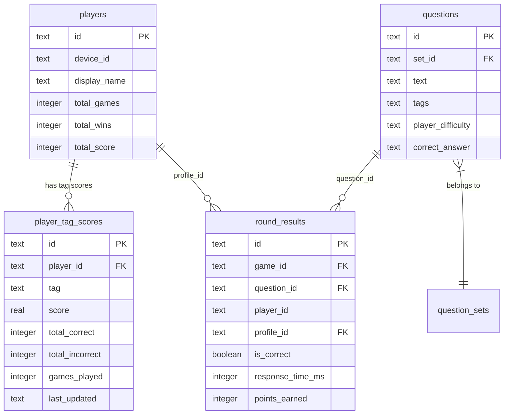

# Tag-Based Question Difficulty Personalization

## Overview

Add a tag system that tracks per-player performance across games to personalize question difficulty. Each question can have multiple tags (e.g., "Zelda", "Nintendo", "gaming"). When a player answers, their tag scores update proportionally to game points earned (correct) or a fixed penalty (incorrect). Over time, this builds a player profile that influences **dynamic per-round question selection** — the primary catch-up mechanism. Each round, the system picks questions that are easier for trailing players, giving them a natural chance to close the gap. A small difficulty multiplier provides a slight bonus for answering questions you're weak at, but question selection is the main lever — not scoring penalties.

## Problem Statement

Currently, all questions are selected randomly (`ORDER BY RANDOM()`) or served from a specific set in authored order. Every player sees the same difficulty regardless of their knowledge. A trivia expert in gaming and a complete novice get the same points for the same question, which feels unfair and makes games less interesting for mixed-skill groups.

The infrastructure is partially in place — `questions.tags` (JSON array) and `questions.player_difficulty` (JSON object) already exist in the schema but are **unused at runtime**. Player profiles exist with `deviceId`-based identification. Round results are persisted. The gap is connecting these pieces with a scoring engine and selection algorithm.

## Proposed Solution

### High-Level Architecture

```
┌─────────────────────────────────────────────────────────┐
│                    Game Flow (per round)                 │
│                                                         │
│  1. Select NEXT question dynamically (tag-aware,        │
│     favoring trailing players)                          │
│  2. Compute per-player difficulty from tag scores       │
│  3. Broadcast question (same for all players)           │
│  4. Collect answers, compute base score (existing)      │
│  5. Apply small difficulty multiplier to score          │
│  6. Broadcast results with difficulty context            │
│  7. Update player tag scores incrementally              │
│  8. Repeat from 1 for next round (scores inform pick)  │
└─────────────────────────────────────────────────────────┘

┌─────────────────────────────────────────────────────────┐
│                  Data Model (new)                        │
│                                                         │
│  player_tag_scores: player_id, tag, score,              │
│    total_correct, total_incorrect, last_updated         │
│                                                         │
│  round_results: + profile_id column (links to           │
│    persistent player identity)                          │
└─────────────────────────────────────────────────────────┘
```

### Key Design Decisions

| Decision | Choice | Rationale |
|----------|--------|-----------|
| Static `playerDifficulty` | Keep as manual override | Game masters can fine-tune specific player/question combos. Tag-computed difficulty is the default. Static fully replaces when present. |
| Question selection | Same question for all players | Preserves competitive aspect. Tag scores influence *which* questions are picked, not *per-player* questions. |
| Player identity | Profile-based (currently deviceId) | Tied to `PlayerProfile`. Future account system replaces deviceId. Anonymous/web guests don't accumulate tag scores. |
| Tag scoring weight | Full game points per tag | Each tag on a question gets the full score (not divided). A correct answer worth 850 points adds +850 to every tag on that question. |
| Wrong answer penalty | Fixed -200 per tag | Keeps negative signal bounded. Prevents a single bad round from destroying a profile. |
| Confidence decay | Exponential, half-life of 10 games | Recent performance matters more. After 10 games, old data contributes ~50% as much. Game-count-based, not time-based. |
| Selection timing | Dynamic per-round | Each round, next question is selected based on current scores and tag profiles. Trailing players get questions easier for them. Pool loaded at game start, selection happens per round. |
| Selection objective | Favor trailing players | Pick questions that are EASIER for players who are behind in score. This is the primary catch-up mechanism. |
| Configured games | No reordering | Tag selection does NOT apply to configured sets (preserves authored order). Tag *scoring* still records performance. |
| Local mode | Hosted-mode only for v1 | Local mode has no player profiles. Adding profiles to local is out of scope for this feature. |
| Difficulty multiplier | Small, visible to players | Range [0.95, 1.10]. Slight bonus for hard questions, near-zero penalty for easy ones. Question selection is the main catch-up lever, not scoring. Shown on TV results and mobile. |
| Timeouts | Treated as wrong answers | Player had the opportunity. Timeout applies the -200 per-tag penalty. |
| Tag normalization | Lowercase, trimmed | `"Zelda"` and `"zelda"` are the same tag. Normalized at import and at scoring time. |
| Max tags per question | Soft limit of 10 | Enforced in YAML validator. Prevents signal dilution. |
| Backfill | No backfill for v1 | Tag scores start fresh. Historical `round_results` available for future backfill. |

## Technical Approach

### Architecture

#### New Data Model

```sql
-- Migration V3: Tag-based personalization
-- New table: per-player, per-tag aggregate scores
CREATE TABLE IF NOT EXISTS player_tag_scores (
  id TEXT PRIMARY KEY,              -- UUID
  player_id TEXT NOT NULL,          -- References players.id (persistent profile)
  tag TEXT NOT NULL,                -- Normalized tag (lowercase, trimmed)
  score REAL NOT NULL DEFAULT 0,    -- Weighted cumulative score
  total_correct INTEGER NOT NULL DEFAULT 0,
  total_incorrect INTEGER NOT NULL DEFAULT 0,
  games_played INTEGER NOT NULL DEFAULT 0,  -- For decay computation
  last_updated TEXT NOT NULL DEFAULT (datetime('now')),
  UNIQUE(player_id, tag),
  FOREIGN KEY (player_id) REFERENCES players(id) ON DELETE CASCADE
);

CREATE INDEX idx_player_tag_scores_player ON player_tag_scores(player_id);
CREATE INDEX idx_player_tag_scores_tag ON player_tag_scores(tag);

-- Add profile_id to round_results for cross-game linkage
ALTER TABLE round_results ADD COLUMN profile_id TEXT REFERENCES players(id) ON DELETE SET NULL;
CREATE INDEX idx_round_results_profile ON round_results(profile_id);
```



#### Tag Scoring Formula

All scoring functions live in `packages/game-logic/src/utils/tagScoring.ts` as pure, testable functions.

**1. Update tag scores after a round:**

```typescript
interface TagScoreUpdate {
  tag: string;
  delta: number;       // Points to add (positive or negative)
}

function computeTagUpdates(
  questionTags: string[],
  isCorrect: boolean,
  gamePointsEarned: number,  // 0-1000
): TagScoreUpdate[] {
  const WRONG_PENALTY = -200;
  const normalizedTags = questionTags.map(t => t.toLowerCase().trim());

  return normalizedTags.map(tag => ({
    tag,
    delta: isCorrect ? gamePointsEarned : WRONG_PENALTY,
  }));
}
```

**2. Apply confidence decay when reading scores:**

```typescript
function decayedScore(
  rawScore: number,
  gamesPlayedSinceUpdate: number,
  halfLife: number = 10,
): number {
  // Exponential decay: score * 0.5^(games/halfLife)
  return rawScore * Math.pow(0.5, gamesPlayedSinceUpdate / halfLife);
}
```

**3. Compute per-player difficulty for a question:**

```typescript
function computePlayerDifficulty(
  playerTagScores: Map<string, number>,  // tag -> decayed score
  questionTags: string[],
): number {
  const normalizedTags = questionTags.map(t => t.toLowerCase().trim());
  const relevantScores = normalizedTags
    .map(tag => playerTagScores.get(tag))
    .filter((s): s is number => s !== undefined);

  if (relevantScores.length === 0) return 2.5; // Default: medium difficulty

  // Average of tag scores, mapped to 1-5 difficulty scale
  const avgScore = relevantScores.reduce((a, b) => a + b, 0) / relevantScores.length;

  // Higher tag score = lower difficulty (player is good at this)
  // Map score range to difficulty: high positive score -> 1 (easy), low/negative -> 5 (hard)
  // Score range is roughly -2000 to +5000 based on typical play
  const normalized = Math.max(0, Math.min(1, (avgScore + 2000) / 7000));
  return 5 - (normalized * 4); // Maps to 5 (hard) -> 1 (easy)
}
```

**4. Difficulty-to-score multiplier:**

```typescript
function difficultyMultiplier(difficulty: number): number {
  // Intentionally small range: [0.95, 1.10]
  // Question selection is the main catch-up mechanism, not scoring.
  // This just gives a slight nod to players answering hard-for-them questions.
  // difficulty 1 (easy for you) -> 0.95x (barely noticeable)
  // difficulty 5 (hard for you) -> 1.10x (small reward)
  // difficulty 2.5 (default) -> 1.025x (~neutral)
  const multiplier = 0.95 + (difficulty - 1) * 0.0375;
  return Math.max(0.95, Math.min(1.10, multiplier));
}
```

**5. Resolve effective difficulty (static override vs dynamic):**

```typescript
function resolvePlayerDifficulty(
  playerName: string,
  staticDifficulty: Record<string, number> | null,  // From YAML playerDifficulty
  dynamicDifficulty: number,                         // From tag scores
): number {
  if (!staticDifficulty) return dynamicDifficulty;

  // Case-insensitive name matching
  const lowerName = playerName.toLowerCase();
  const matchedKey = Object.keys(staticDifficulty)
    .find(k => k.toLowerCase() === lowerName);

  if (matchedKey) return staticDifficulty[matchedKey];
  if (staticDifficulty.default !== undefined) return staticDifficulty.default;

  return dynamicDifficulty;
}
```

#### Dynamic Per-Round Question Selection (Casual Mode Only)

The question pool is loaded at game start, but the **next question is selected dynamically each round** based on current game scores and tag profiles. This is the primary catch-up mechanism.

**Core principle:** Pick questions that are EASIER for trailing players. Players who are behind get questions in their strong tags, giving them a natural chance to answer correctly and close the gap.

```typescript
interface RoundSelectionContext {
  players: Array<{
    profileId: string;
    name: string;
    currentScore: number;        // Game score so far
  }>;
  playerTagScores: Map<string, Map<string, number>>; // profileId -> tag -> decayed score
}

function selectNextQuestion(
  remainingPool: QuestionWithMeta[],   // Questions not yet used this game
  context: RoundSelectionContext,
): QuestionWithMeta {
  if (remainingPool.length === 1) return remainingPool[0];

  // Identify trailing players (below average score)
  const avgScore = context.players.reduce((s, p) => s + p.currentScore, 0) / context.players.length;
  const trailingPlayers = context.players.filter(p => p.currentScore < avgScore);

  // If no one is trailing (all tied or first round), fall back to random
  if (trailingPlayers.length === 0 || trailingPlayers.length === context.players.length) {
    return remainingPool[Math.floor(Math.random() * remainingPool.length)];
  }

  // Score each candidate question: how easy is it for trailing players?
  const scored = remainingPool.map(q => {
    const tags = q.tags ?? [];
    if (tags.length === 0) return { question: q, catchUpScore: 0 };

    // For each trailing player, compute how EASY this question is for them
    // Lower difficulty = easier = higher catch-up score
    const trailingEasiness = trailingPlayers.map(p => {
      const tagScores = context.playerTagScores.get(p.profileId) ?? new Map();
      const difficulty = computePlayerDifficulty(tagScores, tags);
      return 5 - difficulty; // Invert: 5=very easy, 0=very hard
    });

    // For leading players, compute how HARD this question is for them
    const leadingPlayers = context.players.filter(p => p.currentScore >= avgScore);
    const leadingHardness = leadingPlayers.map(p => {
      const tagScores = context.playerTagScores.get(p.profileId) ?? new Map();
      const difficulty = computePlayerDifficulty(tagScores, tags);
      return difficulty; // Higher = harder for leaders (good for catch-up)
    });

    // Catch-up score = how much this question helps trailing players
    // Weight: 70% trailing easiness + 30% leading hardness
    const avgTrailingEasiness = trailingEasiness.reduce((a, b) => a + b, 0) / trailingEasiness.length;
    const avgLeadingHardness = leadingHardness.reduce((a, b) => a + b, 0) / leadingHardness.length;

    const catchUpScore = avgTrailingEasiness * 0.7 + avgLeadingHardness * 0.3;

    return { question: q, catchUpScore };
  });

  // Weighted random from top candidates (not purely deterministic — keeps variety)
  // Sort by catch-up score, take top 5 candidates, pick randomly with weighting
  scored.sort((a, b) => b.catchUpScore - a.catchUpScore);
  const topCandidates = scored.slice(0, Math.min(5, scored.length));

  // Weighted random: higher catch-up score = more likely to be picked
  const totalWeight = topCandidates.reduce((s, c) => s + Math.max(c.catchUpScore, 0.1), 0);
  let roll = Math.random() * totalWeight;
  for (const candidate of topCandidates) {
    roll -= Math.max(candidate.catchUpScore, 0.1);
    if (roll <= 0) return candidate.question;
  }

  return topCandidates[0].question;
}
```

**How the score gap affects selection strength:**
- **All tied / first round:** Pure random (no bias needed).
- **Small gap:** Mild preference toward trailing-friendly questions. The weighted random ensures variety.
- **Large gap:** Stronger preference, but the top-5-with-randomness ensures it never feels rigged.
- **Configured game sets:** Selection is bypassed — questions served in authored order. Tag scoring still records performance for future casual games.

#### WebSocket Protocol Changes

Add tag context to `ROUND_END` so the TV host and mobile apps can display difficulty info:

```typescript
// In packages/ws-protocol/src/messages.ts

// Add to RoundResult payload
export interface PlayerRoundResult {
  playerId: string;
  answer: AnswerKey | null;
  isCorrect: boolean;
  responseTimeMs: number | null;
  baseScore: number;              // Score before multiplier
  difficultyMultiplier: number;   // 0.95 - 1.10 (intentionally small)
  pointsEarned: number;           // baseScore * difficultyMultiplier (rounded)
  totalScore: number;
}

// Add to RoundResult
export interface RoundResult {
  questionId: string;
  correctAnswer: AnswerKey;
  explanation?: string;
  tags?: string[];                // Question tags (for UI display)
  results: PlayerRoundResult[];
  rankings: RankEntry[];
}
```

### Implementation Phases

#### Phase 1: Data Foundation

**Goal:** Get the data model in place and start recording tag-linked results without changing gameplay.

- [x] **Add migration V2** — `player_tag_scores` table + `round_results.profile_id` column
  - File: `packages/db/src/migrations.ts`
  - Added `MIGRATION_V2` string, updated `runMigrations()` to execute it
- [x] **Add `profile_id` population** — When inserting round results, include `profileId` from `RoomPlayer`
  - File: `apps/server/src/room.ts` (in `showRoundResults()`, ~line 532)
  - The `RoomPlayer` already has `profileId?: string` — pass it through to `insertRoundResults()`
- [x] **Update `insertRoundResults` signature** — Accept and store `profile_id`
  - File: `packages/db/src/repositories/games.ts`
- [x] **Add `playerTagScores` repository** — CRUD operations for `player_tag_scores` table
  - File: `packages/db/src/repositories/playerTagScores.ts` (new)
  - Functions: `getPlayerTagScores(db, playerId)`, `upsertTagScore(db, playerId, tag, delta, isCorrect)`, `getTagScoresForPlayers(db, playerIds)`
- [x] **Export from `packages/db`** — Add to barrel export
  - File: `packages/db/src/index.ts`

**Acceptance criteria:**
- Migration runs cleanly on existing databases
- `profile_id` is populated in `round_results` for profiled players (null for anonymous)
- Repository functions have unit tests

---

#### Phase 2: Tag Scoring Engine

**Goal:** Pure scoring functions in `packages/game-logic`, fully tested.

- [x] **Create `tagScoring.ts`** with all pure functions
  - File: `packages/game-logic/src/utils/tagScoring.ts` (new)
  - Functions: `computeTagUpdates()`, `decayedScore()`, `computePlayerDifficulty()`, `difficultyMultiplier()`, `resolvePlayerDifficulty()`
  - All functions are pure (no I/O, no side effects)
- [x] **Create `questionSelection.ts`** for dynamic per-round selection
  - File: `packages/game-logic/src/utils/questionSelection.ts` (new)
  - Function: `selectNextQuestion(remainingPool, context)` — returns single question for next round
  - Favors questions that are easier for trailing players
  - Falls back to random selection when no tag data / all tied / first round
- [x] **Export from `packages/game-logic`**
  - File: `packages/game-logic/src/index.ts`
- [x] **Write comprehensive tests**
  - File: `packages/game-logic/src/__tests__/tagScoring.test.ts` (new)
  - Test cases:
    - Correct answer adds full game points to each tag
    - Wrong answer applies -200 per tag
    - Timeout treated as wrong answer
    - Decay reduces old scores appropriately
    - No tag data → default difficulty (2.5)
    - Static `playerDifficulty` overrides dynamic when present
    - Case-insensitive tag normalization
    - Multiplier clamped to [0.95, 1.10]
  - File: `packages/game-logic/src/__tests__/questionSelection.test.ts` (new)
  - Test cases:
    - All tied / first round → random selection (no bias)
    - Trailing player → questions easier for them are preferred
    - Leading player good at tag X, trailing player also good at tag X → no catch-up benefit from tag X questions
    - Leading player good at tag X, trailing player good at tag Y → tag Y questions preferred
    - Empty player tag scores → random selection
    - Single question remaining → returns it directly
    - Questions with no tags → treated neutrally (catch-up score 0)
    - Never returns a question already used this game
    - Configured mode bypasses selection (tested at integration level)

**Acceptance criteria:**
- All scoring functions are pure and deterministic (given same inputs)
- 100% branch coverage on scoring functions
- Selection function returns correct count, handles edge cases

---

#### Phase 3: Server Integration

**Goal:** Wire tag scoring into the game flow with dynamic per-round question selection. Tag scores update after each round and feed into the next round's question pick.

- [x] **Load question pool and player tag scores at game start**
  - File: `apps/server/src/room.ts` (in `startGame()`, ~line 310)
  - Load the full question pool into `this.questionPool: QuestionWithMeta[]` (casual: random pool, configured: set questions)
  - Load tag scores for all profiled players → `this.playerTagScores: Map<string, Map<string, number>>`
  - Initialize `this.usedQuestionIds: Set<string>` to track which questions have been shown
  - **Key change:** Do NOT pre-select the N questions. Only load the pool.
- [x] **Select next question dynamically each round (casual mode)**
  - File: `apps/server/src/room.ts` (in `showNextQuestion()`, ~line 360)
  - Before showing a question, call `selectNextQuestion()` with:
    - Remaining pool (pool minus `usedQuestionIds`)
    - Current player scores (from `this.players`)
    - Player tag scores (`this.playerTagScores`)
  - Add the selected question's ID to `usedQuestionIds`
  - **Configured mode:** Still uses authored order (index-based, no selection logic)
  - **Fallback:** If no players have profiles or all questions lack tags, pick randomly from remaining pool
- [x] **Compute per-player difficulty before each round**
  - File: `apps/server/src/room.ts` (in `showNextQuestion()` or `sendQuestion()`, ~line 393)
  - For each player, compute difficulty using `resolvePlayerDifficulty()`
  - Store as `this.currentRoundDifficulties: Map<string, number>` (playerId → difficulty)
- [x] **Apply small difficulty multiplier to scoring**
  - File: `apps/server/src/room.ts` (in `showRoundResults()`, ~line 467)
  - After `calculateScore()`, apply `difficultyMultiplier()` to the result
  - `pointsEarned = Math.round(baseScore * difficultyMultiplier(playerDifficulty))`
  - Multiplier range is [0.95, 1.10] — intentionally small, not the main catch-up lever
- [x] **Update tag scores after each round (feeds next selection)**
  - File: `apps/server/src/room.ts` (in `showRoundResults()`, after persisting round results)
  - For each profiled player: call `computeTagUpdates()` and `upsertTagScore()` for each tag
  - **Also update `this.playerTagScores` in memory** so the next round's `selectNextQuestion()` uses fresh data
  - DB persistence is fire-and-forget (non-blocking), but in-memory update is synchronous
- [x] **Update `ROUND_END` payload** to include tag/difficulty context
  - File: `apps/server/src/room.ts` (in `showRoundResults()`)
  - Add `tags`, `baseScore`, `difficultyMultiplier`, to `PlayerRoundResult`
- [x] **Update wire protocol types**
  - File: `packages/ws-protocol/src/messages.ts`
  - Add fields to `PlayerRoundResult` and `RoundResult` as specified above

**Acceptance criteria:**
- Each round dynamically selects the next question based on current game state
- Trailing players get questions easier for them (verifiable in tests)
- Questions are never repeated within a game (`usedQuestionIds` enforced)
- Difficulty multiplier is small [0.95, 1.10] — doesn't punish strong players
- Tag scores update in memory after each round, influencing the next pick
- Configured games are unaffected (authored order, but multiplier still applies)
- Anonymous players get default difficulty (2.5, multiplier ~1.025x ≈ neutral)
- Game still works when all players are new (no tag data → random selection, flat scoring)
- Game works when pool has fewer questions than rounds requested (graceful exhaustion)

---

#### Phase 4: Protocol & UI Updates

**Goal:** Display difficulty context on TV host and mobile apps.

- [x] **TV Host: Show difficulty multiplier on results screen**
  - File: `apps/tv-host/` — results phase component
  - Show per-player: `baseScore × multiplier = finalScore`
  - Subtle visual indicator (e.g., color-coded difficulty badge)
- [x] **TV Host: Show question tags on results screen**
  - Display tags below the question during RESULTS phase
- [x] **Mobile: Show subtle difficulty indicator during question**
  - File: `apps/mobile/` — question phase component
  - Small indicator (e.g., 1-5 dots or colored accent) showing personal difficulty
  - No multiplier value shown during question — keep focus on answering
- [x] **Mobile: Show score breakdown on round results**
  - Show: `baseScore × multiplier = earned` only when multiplier differs from 1.0
  - If multiplier > 1.0, subtle positive highlight (e.g., small "+5%" badge)
  - If multiplier < 1.0, no special treatment (the penalty is tiny, don't draw attention)
- [x] **Update i18n strings**
  - File: `packages/i18n/` — English and Italian translations
  - Keys for: difficulty label, multiplier display, tag names (or just pass through raw)

**Acceptance criteria:**
- Difficulty multiplier visible on both TV and mobile results
- Tags displayed on TV results screen
- Players can see their personal difficulty rating for each question
- UI degrades gracefully when no tag data exists (no empty indicators)

---

#### Phase 5: REST API & Analytics

**Goal:** Expose tag performance data through the existing API.

- [x] **Add tag scores to player stats endpoint**
  - File: `apps/server/src/routes/players.ts`
  - `GET /api/players/:id/stats` — add `tagScores` array to response
  - Shape: `{ tag: string, score: number, correct: number, incorrect: number, gamesPlayed: number }[]`
  - Sorted by absolute score descending (strongest tags first)
- [ ] **Add tag leaderboard endpoint** (optional, nice-to-have)
  - `GET /api/tags/:tag/leaderboard` — top players for a specific tag
- [x] **Add tag list endpoint**
  - `GET /api/tags` — all known tags with question counts

**Acceptance criteria:**
- Player stats endpoint returns tag scores
- Tags endpoint returns all tags in the system

---

#### Phase 6: YAML Validator & Example Updates

**Goal:** Guide game masters in authoring tagged questions.

- [x] **Update example YAML** to demonstrate tags per question
  - File: `questions/example.yaml`
  - Add `tags` to each question in the example set
- [x] **Add tag normalization to import pipeline**
  - File: `packages/db/src/import/validator.ts`
  - Normalize tags: lowercase, trim, deduplicate
  - Enforce max 10 tags per question (soft limit, warn on import)
- [x] **Update question-set.schema.json** if needed
  - File: `packages/db/question-set.schema.json`
  - Add `maxItems: 10` to tags array definition

**Acceptance criteria:**
- Example YAML shows best practices for tagging
- Import normalizes tags consistently
- Schema validates tag count

## Alternative Approaches Considered

### 1. Per-Player Question Selection (Rejected)

Each player gets different questions tuned to their profile. Rejected because it fundamentally changes the competitive dynamic — players are no longer competing on the same questions. Would require major protocol changes (per-player QUESTION messages).

### 2. Compute Tag Scores On-the-Fly from round_results (Rejected)

Instead of a `player_tag_scores` table, join `round_results` with `questions.tags` at query time. Rejected because:
- Requires parsing JSON tags for every question in every join
- O(n) in total round results, gets slower over time
- Decay computation on raw data is expensive
- A denormalized table with incremental updates is simpler and faster

### 3. Normalized Tags Table / question_tags Junction (Deferred)

A `question_tags(question_id, tag)` table would enable efficient SQL queries on tags. Deferred because:
- Current question pool is small (tens to hundreds)
- JSON parsing in the application layer is fast enough
- Can be added later as an optimization without changing the API

### 4. Pre-Game Batch Selection (Rejected)

Selecting all N questions at game start based on pre-game tag profiles. Rejected because:
- Cannot react to within-game score changes (a player falling behind mid-game gets no help)
- The catch-up mechanism only works between games, not within them
- Per-round selection is architecturally simple: load pool at start, pick one per round from remaining
- Latency is negligible — `selectNextQuestion()` is a pure function over in-memory data, no DB queries

### 5. Tag Hierarchy / Ontology (Deferred)

Grouping tags into hierarchies (e.g., "Zelda" is-a "Nintendo" is-a "Gaming"). Deferred because:
- Adds significant complexity
- Flat tags with multiple tags per question achieve a similar effect organically
- A question tagged `["Zelda", "Nintendo", "gaming"]` already creates implicit hierarchy through co-occurrence

## Acceptance Criteria

### Functional Requirements

- [ ] Questions can have tags (already in schema, validated on import)
- [ ] Tag scores accumulate per-player, per-tag across games
- [ ] Correct answers add game-points-proportional score to each tag
- [ ] Wrong answers and timeouts apply -200 penalty per tag
- [ ] Confidence decay reduces weight of old performance (half-life: 10 games)
- [ ] Per-player difficulty computed from tag scores (1-5 scale, default 2.5)
- [ ] Static `playerDifficulty` from YAML overrides dynamic when present
- [ ] Difficulty multiplier applied to game scores (range 0.95x-1.10x, intentionally small)
- [ ] Casual mode uses dynamic per-round question selection (favoring trailing players)
- [ ] Configured mode preserves authored question order (no reordering)
- [ ] Same question served to all players (no per-player questions)
- [ ] Anonymous/web players get default difficulty, no tag accumulation
- [ ] Multiplier and tags visible on TV results screen
- [ ] Personal difficulty indicator visible on mobile during question
- [ ] Tag scores available via REST API

### Non-Functional Requirements

- [ ] Tag score update is non-blocking (fire-and-forget, same as existing round results)
- [ ] Per-round question selection adds <10ms per round (pure function over in-memory data)
- [ ] All scoring functions are pure and testable in isolation
- [ ] Scoring functions live in `packages/game-logic` (shared, no duplication)
- [ ] Migration is idempotent and safe for tvOS cache-directory DB

### Quality Gates

- [ ] Unit tests for all scoring functions (100% branch coverage)
- [ ] Integration test: full game flow with tag scoring enabled
- [ ] E2E test: multiplier visible on results screen
- [ ] Manual test: multi-game session shows tag scores evolving

## Success Metrics

- **Tag coverage:** >80% of questions in active sets have at least one tag
- **Profile coverage:** >50% of games have at least one profiled player
- **Score variance:** Games with tag scoring show measurably different point distributions compared to flat scoring (multipliers are actually being applied)
- **Player engagement:** Qualitative — players notice and comment on the difficulty indicators

## Dependencies & Prerequisites

| Dependency | Status | Impact |
|------------|--------|--------|
| `questions.tags` column | Exists (unused) | None — ready to use |
| `questions.player_difficulty` column | Exists (unused) | None — ready to use |
| Player profiles (`players` table) | Exists | Tag scores FK to `players.id` |
| `round_results` table | Exists | Needs `profile_id` column added |
| `deviceId` on JOIN message | Exists | Profile lookup already works |
| YAML import with tags | Exists (validated) | Just need example updates |

**No external dependencies.** Everything builds on existing infrastructure.

## Risk Analysis & Mitigation

### High Risk

**Dual orchestration:** Both `room.ts` (server) and `GameController.ts` (TV local mode) implement game flow. Scoring functions MUST live in `packages/game-logic` to avoid duplication. However, local mode won't have tag scoring in v1, so the risk is limited to ensuring the shared functions work when called from both contexts in the future.

**Mitigation:** All tag scoring logic as pure functions in `packages/game-logic`. Server imports and calls them. Local mode ignores them for now.

### Medium Risk

**Score gaming:** Players could intentionally answer wrong to lower their tag scores, hoping the system picks "easier" questions for them as a trailing player.

**Mitigation:** This is self-defeating. Answering wrong costs 0 game points AND applies -200 per-tag penalty. The catch-up selection helps trailing players, but you still have to *answer correctly* to benefit. The multiplier is tiny (max 10% bonus) so gaming it is pointless. The main benefit of trailing is getting questions in your strong tags — but you need actual knowledge to capitalize.

**Cold start:** New players and players with sparse tag data get default difficulty. The system becomes useful only after several games.

**Mitigation:** Default difficulty (2.5) maps to 1.0x multiplier — no penalty or bonus. The system is invisible until enough data exists.

### Low Risk

**Tag fragmentation:** Different game masters using different tag names for the same concept (e.g., "Zelda" vs "Legend of Zelda"). Normalization (lowercase, trim) helps but doesn't solve semantic equivalence.

**Mitigation:** Document tagging best practices in example YAML. Consider tag suggestions/autocomplete in a future UI.

## Future Considerations

- **Tag hierarchy/ontology** — Group related tags for broader matching
- **Player profile UI** — Mobile screen showing tag strengths/weaknesses
- **AI-assisted tagging** — Suggest tags when importing questions without them
- **Local mode support** — Add player profiles to local mode, enable tag scoring
- **Tag-based matchmaking** — Group players with complementary strengths for balanced games
- **Backfill historical data** — Compute initial tag scores from existing `round_results`

## Documentation Plan

- Update `CLAUDE.md` with tag scoring architecture notes
- Update `questions/example.yaml` with tag examples and best practices
- Add inline code comments to scoring formula explaining the math

## References & Research

### Internal References

- Question schema: `packages/db/src/schema.ts:83-101` — `QuestionWithMeta` already has `tags` and `playerDifficulty`
- DB migration: `packages/db/src/migrations.ts:27-48` — existing `tags TEXT` and `player_difficulty TEXT` columns
- Scoring: `packages/game-logic/src/utils/scoring.ts:1-69` — current `calculateScore()` function
- Round results recording: `apps/server/src/room.ts:467-566` — `showRoundResults()` method
- Question selection: `packages/db/src/repositories/questions.ts:94-115` — `getRandomQuestions()`
- Player profiles: `packages/db/src/schema.ts:116-126` — `PlayerProfile` type
- YAML import: `packages/db/src/import/validator.ts:12-24` — `QuestionInput` with tags
- Wire protocol: `packages/ws-protocol/src/messages.ts` — all message types

### Related Work

- MVP plan: `docs/plans/2026-02-05-feat-vibechallengers-multiplayer-quiz-game-plan.md`
- Adaptive engine plan: `docs/plans/2026-02-06-feat-adaptive-quiz-engine-plan.md` — designed `QuestionPicker` interface and `playerDifficulty` field (deferred smart selection per YAGNI)
