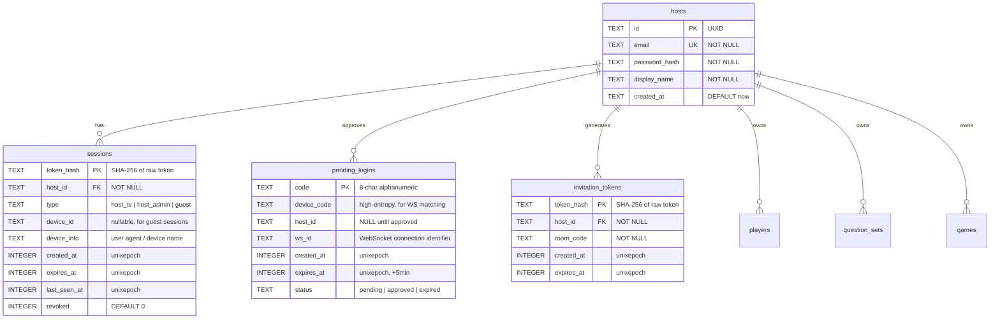

# Account System with Multi-Tenant Host Auth

## Overview

Add an authentication and multi-tenancy layer to the hosted server. Host accounts (email + password, CLI-created) isolate all data per-host. The TV app authenticates via a device-flow QR login. Mobile players link to a host account by scanning the game QR (which embeds an invitation token), enabling persistent reconnection without re-scanning. All existing modes (local, unauthenticated hosted) remain fully functional.

Brainstorm: `docs/brainstorms/2026-03-14-account-system-brainstorm.md`

## Problem Statement / Motivation

The game server is moving to a privately hosted environment. Without accounts, anyone who knows the server URL can create rooms, access all players/questions, and see all game history. Multi-tenancy is needed so multiple hosts can share a server with full data isolation. Persistent mobile linking eliminates the friction of scanning a QR code every session.

## Proposed Solution

Five implementation phases, each independently deployable:

1. **Foundation** — DB schema, auth utilities, CLI account creation
2. **Admin Panel Auth** — Login page, session cookies, route scoping
3. **TV Device-Flow Login** — QR-based TV authentication via WebSocket
4. **Mobile Guest Linking** — Invitation tokens, returning user flow, persistent sessions
5. **Data Migration Script** — CLI tool to move existing data to a host account

## Technical Approach

### Architecture

#### New Database Tables (Migration V13)



#### Existing Tables — Add `host_id` Column

All tenant-scoped tables get a nullable `host_id TEXT REFERENCES hosts(id)`:

| Table | Change | Index |
|-------|--------|-------|
| `players` | Add `host_id`, change UNIQUE from `(device_id)` to `(host_id, device_id)` | `idx_players_host` |
| `question_sets` | Add `host_id` | `idx_question_sets_host` |
| `questions` | Scoped via `question_set_id` FK (no direct `host_id` needed) | — |
| `meta_sets` | Add `host_id` | `idx_meta_sets_host` |
| `games` | Add `host_id` | `idx_games_host` |
| `round_results` | Scoped via `game_id` FK | — |
| `player_tag_scores` | Add `host_id` | `idx_player_tag_scores_host` |
| `events` | Add `host_id` | `idx_events_host` |

**Backward compatibility:** `host_id IS NULL` means unscoped data (pre-account or unauthenticated mode). Repo functions accept an optional `hostId` parameter; when `undefined`, they omit the WHERE clause (matching current behavior).

#### Token Architecture

```
Token Type        | Entropy  | Storage        | TTL        | Use
------------------|----------|----------------|------------|--------------------
Host session (TV) | 32 bytes | DB (SHA-256)   | No expiry* | TV ↔ server auth
Host session (admin) | 32 bytes | Cookie (SHA-256 in DB) | 7 days | Admin panel
Guest session     | 32 bytes | DB (SHA-256)   | 90 days    | Mobile persistent link
Invitation token  | 16 bytes | DB (SHA-256)   | Room lifetime | QR guest linking
Pending login code | 8 chars | In-memory Map  | 5 minutes  | TV device flow
Device code       | 32 bytes | In-memory Map  | 5 minutes  | TV WS matching

* TV sessions persist until explicit logout or password change
```

All tokens: generated with `crypto.getRandomValues()`, stored as `SHA-256(token)`, never stored raw.

#### New WebSocket Message Types

```typescript
// packages/ws-protocol/src/messages.ts

// Server → Host (TV)
| { type: 'AUTH_CHALLENGE'; payload: { userCode: string; verificationUrl: string; expiresIn: number } }
| { type: 'AUTH_SUCCESS'; payload: { sessionToken: string; hostId: string; displayName: string } }
| { type: 'AUTH_FAILED'; payload: { reason: string } }
| { type: 'AUTH_EXPIRED' }  // pending login code timed out, TV should request new one

// Client → Server (extend IDENTIFY)
| { type: 'IDENTIFY'; payload: { deviceId: string; sessionToken?: string; invitationToken?: string } }

// Host → Server (new)
| { type: 'REQUEST_AUTH'; payload: { deviceCode: string } }  // TV requests login challenge
```

### Implementation Phases

#### Phase 1: Foundation (DB + Auth Core)

**New files:**

| File | Purpose |
|------|---------|
| `packages/db/src/repositories/hosts.ts` | Host account CRUD |
| `packages/db/src/repositories/sessions.ts` | Session CRUD, validation, revocation |
| `apps/server/src/auth/tokens.ts` | `generateSecureToken()`, `hashToken()`, `generateUserCode()` |
| `apps/server/src/auth/middleware.ts` | Hono auth middleware (bearer token + cookie) |
| `apps/server/src/scripts/create-account.ts` | CLI tool: `bun run apps/server/src/scripts/create-account.ts` |

**`packages/db/src/repositories/hosts.ts`:**

```typescript
// Pattern: matches existing repo style (stateless async fns, db as first arg)
export async function createHost(db: DbAdapter, email: string, passwordHash: string, displayName: string): Promise<Host>
export async function findByEmail(db: DbAdapter, email: string): Promise<Host | null>
export async function findById(db: DbAdapter, id: string): Promise<Host | null>
export async function updatePassword(db: DbAdapter, id: string, passwordHash: string): Promise<void>
```

**`apps/server/src/auth/tokens.ts`:**

```typescript
import { createHash } from "crypto";

export function generateSecureToken(byteLength = 32): string {
  const bytes = new Uint8Array(byteLength);
  crypto.getRandomValues(bytes);
  return Array.from(bytes).map(b => b.toString(16).padStart(2, '0')).join('');
}

export function hashToken(token: string): string {
  return createHash('sha256').update(token).digest('hex');
}

export function generateUserCode(): string {
  const alphabet = 'BCDFGHJKLMNPQRSTVWXZ'; // no vowels, no ambiguous chars
  const bytes = new Uint8Array(8);
  crypto.getRandomValues(bytes);
  const code = Array.from(bytes).map(b => alphabet[b % alphabet.length]).join('');
  return `${code.slice(0, 4)}-${code.slice(4)}`;
}
```

**`apps/server/src/auth/middleware.ts`:**

```typescript
import { createMiddleware } from 'hono/factory';
import { getCookie } from 'hono/cookie';

type AuthVariables = {
  hostId: string | null;  // null = unauthenticated (backward-compat mode)
};

// For routes that REQUIRE auth
export const requireHostAuth = createMiddleware<{ Variables: AuthVariables }>(async (c, next) => {
  const token = c.req.header('Authorization')?.replace('Bearer ', '') ?? getCookie(c, 'session');
  if (!token) return c.json({ error: 'Unauthorized' }, 401);
  const session = await sessionsRepo.validate(getDb(), hashToken(token));
  if (!session) return c.json({ error: 'Invalid session' }, 401);
  c.set('hostId', session.hostId);
  await next();
});

// For routes that OPTIONALLY scope by host (backward compat)
export const optionalHostAuth = createMiddleware<{ Variables: AuthVariables }>(async (c, next) => {
  const token = c.req.header('Authorization')?.replace('Bearer ', '') ?? getCookie(c, 'session');
  if (token) {
    const session = await sessionsRepo.validate(getDb(), hashToken(token));
    c.set('hostId', session?.hostId ?? null);
  } else {
    c.set('hostId', null);
  }
  await next();
});
```

**`apps/server/src/scripts/create-account.ts`:**

```typescript
// Interactive CLI: prompts for email, password, display name
// Uses Bun.password.hash(password, { algorithm: 'argon2id' })
// Writes to DB directly (safe with WAL mode even if server is running)
```

**Migration V13** in `packages/db/src/migrations.ts`:

- Create `hosts` table
- Create `sessions` table
- Create `pending_logins` table (or keep in-memory only — see below)
- Create `invitation_tokens` table
- Add `host_id` column (nullable) to: `players`, `question_sets`, `meta_sets`, `games`, `player_tag_scores`, `events`
- Drop UNIQUE on `players.device_id`, add UNIQUE on `(host_id, device_id)`
- Add indexes on `host_id` for all modified tables

**Tasks:**

- [ ] Write migration V13 SQL in `packages/db/src/migrations.ts`
- [ ] Add `Host` type to `packages/db/src/schema.ts`
- [ ] Add `Session` type to `packages/db/src/schema.ts`
- [ ] Create `packages/db/src/repositories/hosts.ts` (create, findByEmail, findById, updatePassword)
- [ ] Create `packages/db/src/repositories/sessions.ts` (create, validate, revoke, revokeAllForHost, cleanup)
- [ ] Export new repos from `packages/db/src/index.ts`
- [ ] Create `apps/server/src/auth/tokens.ts` (generateSecureToken, hashToken, generateUserCode)
- [ ] Create `apps/server/src/auth/middleware.ts` (requireHostAuth, optionalHostAuth)
- [ ] Create `apps/server/src/scripts/create-account.ts`
- [ ] Add `create-account` script to `apps/server/package.json`
- [ ] Update all existing repo functions to accept optional `hostId` parameter and conditionally filter
- [ ] Update `packages/db/src/schema.ts` types for tables with new `host_id` field

#### Phase 2: Admin Panel Auth

**New files:**

| File | Purpose |
|------|---------|
| `apps/server/admin/login.html` | Login form page |
| `apps/server/src/routes/auth.ts` | Login/logout REST endpoints |

**`apps/server/src/routes/auth.ts`:**

```typescript
// POST /auth/login — email + password → set session cookie, return JSON
// POST /auth/logout — revoke session, clear cookie
// GET  /auth/me — validate session, return host info (used by admin pages on load)
```

**`apps/server/admin/login.html`:**
- Mobile-first design (used for both admin login and TV device-flow approval)
- Neon Sakura theme (match existing admin panel style)
- Form: email, password, submit
- On success: redirect to `/admin/` (for direct admin login) or show "TV approved, close this tab" (for device flow)

**Admin page auth check:**
- Add a `<script>` block to `admin.js` shared utility that calls `GET /auth/me` on page load
- If 401, redirect to `/admin/login`
- Pass the session token as a cookie (HttpOnly, SameSite=Lax, Secure in production, Path=/admin)

**Route scoping:**
- Replace duplicate `requireAuth()` functions in `questionSets.ts` and `metaSets.ts` with the shared `requireHostAuth` middleware
- All `/api/*` routes that return tenant data use `c.get('hostId')` to filter queries
- `GET /api/health` remains public (no auth)

**Tasks:**

- [ ] Create `apps/server/src/routes/auth.ts` with login, logout, me endpoints
- [ ] Create `apps/server/admin/login.html` with Neon Sakura theme
- [ ] Mount auth routes in `apps/server/src/index.ts`: `app.route('/auth', authRoutes)`
- [ ] Add auth check to `apps/server/admin/admin.js` (fetch `/auth/me` on load, redirect to login if 401)
- [ ] Update `admin.js` `fetchJson()` to include credentials (cookies)
- [ ] Apply `requireHostAuth` middleware to mutation routes (POST/PUT/DELETE on `/api/*`)
- [ ] Apply `optionalHostAuth` middleware to read routes (GET on `/api/*`)
- [ ] Update all route handlers to pass `c.get('hostId')` to repo functions
- [ ] Remove duplicate `requireAuth()` from `questionSets.ts` and `metaSets.ts`
- [ ] Remove `ADMIN_TOKEN` env var support (replaced by session auth)

#### Phase 3: TV Device-Flow Login

**New files:**

| File | Purpose |
|------|---------|
| `apps/server/admin/tv-login.html` | TV approval web page (scanned via QR) |
| `apps/tv-host/src/screens/AccountLoginScreen.tsx` | Shows QR code for device-flow login |
| `apps/tv-host/src/services/AuthService.ts` | Token storage/retrieval for TV |

**Device-flow sequence:**

```
TV App                           Server                          Phone Browser
  |                                |                                |
  | [User selects "I have an      |                                |
  |  account" on ModeSelection]   |                                |
  |                                |                                |
  |-- WS connect /ws?role=host -->|                                |
  |                                | (no room created yet)          |
  |-- REQUEST_AUTH {deviceCode} ->|                                |
  |                                | pendingLogins.set(code, {...}) |
  |<- AUTH_CHALLENGE {userCode,   |                                |
  |   verificationUrl, expiresIn} |                                |
  |                                |                                |
  | [TV shows QR with URL:        |                                |
  |  https://server/auth/         |                                |
  |  tv-login?code=WDJB-MJHT]    |                                |
  |                                |                                |
  |                                |<-- GET /auth/tv-login?code=.. |
  |                                |-- serve tv-login.html -------->|
  |                                |                                |
  |                                |<-- POST /auth/tv-login         |
  |                                |    {code, email, password}     |
  |                                | validate credentials           |
  |                                | create session for host        |
  |                                | find WS by deviceCode          |
  |                                |                                |
  |<- AUTH_SUCCESS {sessionToken, |-- 200 "TV approved" ---------->|
  |   hostId, displayName}        |                                |
  |                                |                                |
  | [TV stores token in           |                                |
  |  AsyncStorage, creates room]  |                                |
  |                                |                                |
  |<- ROOM_CREATED {roomCode} ---|                                |
```

**Pending login storage:** In-memory `Map<deviceCode, PendingLogin>` (not DB — short-lived, lost on restart is fine). Keyed by `deviceCode` (high entropy, for WS matching). `userCode` (human-readable) is used for the QR URL and displayed on TV.

**TV app changes:**

- `ModeSelectionScreen.tsx`: Add 3rd card "I have an account". Reorder: Account → Local → Hosted.
- New `AccountLoginScreen.tsx`: Shows QR code with verification URL. Countdown timer. Cancel button. Auto-refreshes QR on expiry.
- `App.tsx`: Add `'account_login'` to `AppScreen` type. Add transition: `mode_select` → `account_login` → `hosted_game`.
- New `AuthService.ts`: Persist/retrieve `{ sessionToken, serverUrl, hostDisplayName }` in AsyncStorage.
- On app launch: if stored session token exists, skip ModeSelectionScreen, connect directly (show loading → lobby).
- `HostedGameController.ts`: Accept optional `sessionToken` parameter. Include in `REQUEST_AUTH` message. Handle `AUTH_CHALLENGE`, `AUTH_SUCCESS`, `AUTH_FAILED`, `AUTH_EXPIRED` messages.
- Modify WS `onOpen` for `role=host`: Do NOT create room immediately. Wait for either `REQUEST_AUTH` (account mode) or legacy behavior (no-auth mode, create room immediately).

**Server changes:**

- `index.ts` WebSocket `onOpen` for `role=host`: Store WS reference but don't create room yet. Wait for `REQUEST_AUTH` or a timeout (30s → create room for legacy mode).
- New handler in room.ts or separate auth handler: `REQUEST_AUTH` → create pending login → send `AUTH_CHALLENGE`.
- `POST /auth/tv-login`: Validate email+password, find pending login by userCode, mark approved, push `AUTH_SUCCESS` via stored WS reference, create room for authenticated host.
- `GET /auth/tv-login`: Serve `tv-login.html` with the code pre-filled.
- Handle pending login expiry: 5-minute timer, send `AUTH_EXPIRED` to TV WS, clean up.

**Tasks:**

- [ ] Add `AUTH_CHALLENGE`, `AUTH_SUCCESS`, `AUTH_FAILED`, `AUTH_EXPIRED` to `ServerMessage` in `packages/ws-protocol/src/messages.ts`
- [ ] Add `REQUEST_AUTH` to `HostMessage` in `packages/ws-protocol/src/messages.ts`
- [ ] Add validation cases in `packages/ws-protocol/src/validation.ts`
- [ ] Create `apps/server/admin/tv-login.html` (mobile-first login form, Neon Sakura theme)
- [ ] Add `GET /auth/tv-login` and `POST /auth/tv-login` to `apps/server/src/routes/auth.ts`
- [ ] Add pending login in-memory store to server (Map with auto-expiry timers)
- [ ] Modify WS `onOpen` for `role=host` in `apps/server/src/index.ts` — defer room creation
- [ ] Handle `REQUEST_AUTH` host message in server
- [ ] Create `apps/tv-host/src/services/AuthService.ts` (store/retrieve/clear token)
- [ ] Create `apps/tv-host/src/screens/AccountLoginScreen.tsx` (QR display + countdown)
- [ ] Update `apps/tv-host/src/screens/ModeSelectionScreen.tsx` — add 3rd option, reorder
- [ ] Update `apps/tv-host/App.tsx` — add `account_login` screen, auto-connect on stored token
- [ ] Update `apps/tv-host/src/services/HostedGameController.ts` — handle auth messages, accept sessionToken
- [ ] Handle one-TV-per-host enforcement: reject second TV connection for same host_id

#### Phase 4: Mobile Guest Linking

**New files:**

| File | Purpose |
|------|---------|
| `apps/mobile/src/services/authStorage.ts` | Store/retrieve guest session token, server URL, player info |
| `apps/mobile/src/screens/ReturningUserScreen.tsx` | Shows server + player info, Play/Disconnect buttons |

**QR code changes:**

Current authenticated-mode QR format:
```
https://server/mobile/?roomCode=XXXX&invite=TOKEN_HEX
```

The `invite` parameter is a 16-byte hex-encoded invitation token. For web clients, the page auto-extracts it. For native clients, the camera scanner extracts it from the URL.

**Invitation token lifecycle:**

1. When the TV creates a room (after auth), server generates an invitation token for this room+host.
2. Token is included in the QR URL sent to the TV via `ROOM_CREATED`.
3. Mobile scans QR → connects to WS → sends `IDENTIFY { deviceId, invitationToken }`.
4. Server validates invitation token → creates a guest session → links device to host.
5. Server responds with `IDENTITY { profile, guestSessionToken, serverUrl }` (extended payload).
6. Mobile stores `{ guestSessionToken, serverUrl, playerInfo }` in AsyncStorage/localStorage.
7. Invitation token remains valid for the room's lifetime (multi-use — multiple players scan same QR).

**Mobile app launch flow:**

```
App opens
  ├─ Has stored guestSessionToken + serverUrl?
  │   ├─ YES → HTTP GET /auth/me with Bearer token
  │   │   ├─ 200 OK → Show ReturningUserScreen (server, player info, Play/Disconnect)
  │   │   └─ 401 / network error → Clear stored data, show ScanScreen
  │   └─ NO → Show ScanScreen (unchanged)
  └─ (end)
```

**ReturningUserScreen:**
- Shows: server URL (or host display name), player display name, avatar
- "Play" button: connects to server via WS with stored token, proceeds to IDENTIFYING → WELCOME_BACK → WAITING
- "Disconnect" button: clears stored token, revokes session server-side (`POST /auth/logout`), returns to ScanScreen
- Error state: if server unreachable, show error banner with "Retry" and "Disconnect" buttons

**Mobile changes:**

- `GameScreen.tsx`: Add new initial phase check — if stored token, start at `RETURNING` phase (new) instead of `SCAN`.
- New `ReturningUserScreen.tsx`: Server/player info, Play, Disconnect.
- `useGameState.ts`: Add `RETURNING` phase. Add `validateStoredSession()` on mount. Add `disconnect()` callback.
- `ScanScreen.tsx`: Parse `invite` query parameter from QR URL. Pass to `connect()`.
- `WebSocketClient.ts`: Accept optional `sessionToken` in `identify()`. Send in IDENTIFY payload.
- New `authStorage.ts`: `saveGuestSession()`, `getGuestSession()`, `clearGuestSession()`. Uses AsyncStorage (native) / localStorage (web).

**Server changes:**

- `room.ts` `handleIdentify()`: If `invitationToken` is present, validate it, create guest session, include `guestSessionToken` in IDENTITY response.
- `ROOM_CREATED` message: Add `invitationToken` to payload (so TV can build QR URL).
- `GET /auth/me`: Also works for guest sessions (returns host display name + linked player info).
- `POST /auth/logout`: Revoke the session token, unbind device from player profile.

**Tasks:**

- [ ] Create `apps/mobile/src/services/authStorage.ts` (save/get/clear guest session)
- [ ] Create `apps/mobile/src/screens/ReturningUserScreen.tsx`
- [ ] Add `RETURNING` phase to `MobileGamePhase` in `apps/mobile/src/hooks/useGameState.ts`
- [ ] Update `GameScreen.tsx` to check stored session on mount and route to RETURNING
- [ ] Update `ScanScreen.tsx` to extract `invite` param from QR URL
- [ ] Update `WebSocketClient.ts` `identify()` to accept and send `sessionToken` and `invitationToken`
- [ ] Extend `IDENTITY` server message payload with `guestSessionToken` and `serverUrl` fields in `packages/ws-protocol/src/messages.ts`
- [ ] Extend `ROOM_CREATED` payload with `invitationToken` in `packages/ws-protocol/src/messages.ts`
- [ ] Update `useGameController.ts` (TV) to include invitation token in QR URL
- [ ] Create invitation token on room creation in server (`room.ts` or `roomManager.ts`)
- [ ] Handle `invitationToken` in `room.ts` `handleIdentify()` — validate, create guest session, link device
- [ ] Update `GET /auth/me` to support guest sessions
- [ ] Update `POST /auth/logout` to handle guest session revocation

#### Phase 5: Data Migration Script

**New file:**

| File | Purpose |
|------|---------|
| `apps/server/src/scripts/migrate-data.ts` | CLI: copy/move unscoped data to a host account |

**Usage:**

```bash
bun run apps/server/src/scripts/migrate-data.ts --host-email alice@example.com --mode copy
```

**Behavior:**
- Finds all rows where `host_id IS NULL` in: `players`, `question_sets`, `meta_sets`, `games`, `player_tag_scores`, `events`
- Sets their `host_id` to the specified host's ID
- `--mode copy`: Duplicates rows (original stays unscoped, copy goes to host) — safer
- `--mode move`: Updates `host_id` in-place — cleaner
- Runs in a transaction for atomicity
- Reports counts of migrated rows per table

**Tasks:**

- [ ] Create `apps/server/src/scripts/migrate-data.ts`
- [ ] Add `migrate-data` script to `apps/server/package.json`

## Acceptance Criteria

### Functional Requirements

- [ ] Host accounts can be created via CLI with email + password
- [ ] Hosts can log in to `/admin/` and see only their own data
- [ ] TV app shows 3 mode options: "I have an account" / "Local mode" / "I have a local server"
- [ ] TV can authenticate via device-flow QR (scan → web login → TV approved)
- [ ] TV persists auth session across app restarts
- [ ] Game QR code in account mode includes invitation token
- [ ] Mobile scanning the QR links device to host account as a guest
- [ ] Mobile returning user sees server/player info with Play/Disconnect
- [ ] One device = one player under a host (strictly enforced)
- [ ] One host account per mobile device at a time
- [ ] One active TV session per host account
- [ ] Player switch requires logout + re-scan QR
- [ ] Local mode works unchanged (no auth, TV is server)
- [ ] Unauthenticated hosted mode works unchanged (enter URL, no auth)
- [ ] Server with no accounts works exactly as today (all data unscoped)
- [ ] CLI migration script copies/moves unscoped data to a host account

### Non-Functional Requirements

- [ ] Passwords hashed with Argon2id via `Bun.password.hash()`
- [ ] Session tokens: 32 random bytes, SHA-256 hashed before DB storage
- [ ] HTTPS required for account mode (enforced via middleware + HSTS header)
- [ ] HTTP allowed for unauthenticated/local mode
- [ ] Invitation tokens: 16 random bytes, valid for room lifetime, multi-use
- [ ] Pending login codes: 5-minute TTL, auto-refresh on TV
- [ ] No new runtime dependencies (use Bun built-ins for crypto + hashing)

### Quality Gates

- [ ] All existing E2E tests pass (backward compatibility)
- [ ] New E2E tests for: admin login, TV device flow, mobile guest linking, returning user flow
- [ ] `yarn lint` passes
- [ ] `yarn server typecheck` passes

## Dependencies & Prerequisites

- Bun runtime (already used) — provides `Bun.password` for Argon2id hashing
- Hono (already used) — `hono/factory`, `hono/cookie`, `hono/secure-headers` for auth middleware
- HTTPS reverse proxy (Caddy recommended) — required for production, not part of this implementation

## Risk Analysis & Mitigation

| Risk | Impact | Mitigation |
|------|--------|------------|
| Tenant data leakage (missing `host_id` filter) | High | Middleware-level `hostId` injection, CI grep for queries missing `host_id` on scoped tables |
| Breaking backward compatibility | High | All `host_id` columns nullable, all repo functions backward-compatible with `hostId = undefined` |
| Pending login code brute-force | Medium | 8-char base-20 code (~34.5 bits), 5-minute TTL, rate-limit `/auth/tv-login` POST |
| Invitation token interception | Low | Short-lived (room lifetime), multi-use by design, HTTPS enforced |
| SQLite concurrent access during CLI operations | Low | WAL mode already enabled, `busy_timeout = 5000ms` already set |

## Open Questions (to resolve during implementation)

1. **CSRF protection for admin panel** — Should admin form submissions include a CSRF token? (Low risk since admin is on a private server, but good practice.)
2. **Session cleanup frequency** — Periodic timer vs on-demand cleanup of expired sessions/tokens?
3. **TV reconnection after brief disconnect** — Reuse session token or require re-auth? (Recommend: reuse token, same as mobile.)

## References & Research

### Internal References

- Brainstorm: `docs/brainstorms/2026-03-14-account-system-brainstorm.md`
- DB migrations: `packages/db/src/migrations.ts` (currently at V12)
- Repo pattern: `packages/db/src/repositories/players.ts`
- WS protocol: `packages/ws-protocol/src/messages.ts`
- Admin panel: `apps/server/admin/`
- TV mode selection: `apps/tv-host/src/screens/ModeSelectionScreen.tsx`
- Mobile game state: `apps/mobile/src/hooks/useGameState.ts`
- Device ID service: `apps/mobile/src/services/deviceId.ts`

### External References

- [Bun.password API](https://bun.com/docs/runtime/hashing) — built-in Argon2id/bcrypt
- [RFC 8628 — OAuth Device Authorization Grant](https://datatracker.ietf.org/doc/html/rfc8628)
- [Hono Cookie Helper](https://hono.dev/docs/helpers/cookie)
- [Hono createMiddleware](https://hono.dev/docs/helpers/factory)
- [Hono Secure Headers](https://hono.dev/docs/middleware/builtin/secure-headers)
