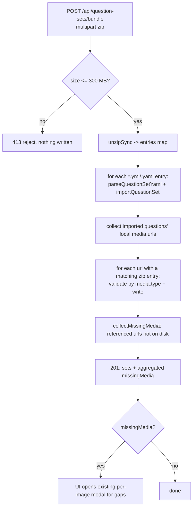

# Dashboard Question Bundle Upload - Plan

**Product Contract preservation:** changed R7/R8 — max archive size raised from
100 MB to 300 MB at the user's request during planning. All other Product
Contract text and R-IDs unchanged.

## Goal Capsule

- **Objective:** Let an admin publish a question set and its media to the hosted
  server in one action — drag a single `.zip` into the dashboard instead of
  uploading the YAML and then hand-matching each image in the media modal.
- **Product authority:** Michele (repo owner / sole admin).
- **Open blockers:** None. Planning-time forks (unzip library, per-type size
  ceilings, AV validation strategy) are resolved in Key Technical Decisions.

---

## Product Contract

### Summary

Add a **bundle upload** path to the dashboard's question-sets page: a single
`.zip` carrying one or more question-set YAML files plus their `media/` folder,
unpacked and imported server-side in one request. The archive is
convention-based — the media type is read from each question's `media.type` in
the YAML, so no manifest is needed and audio/video files store today without a
format change (even though the game can't play them yet). Both
question-authoring skills also emit a ready-to-drag `.zip`.

### Problem Frame

The two authoring skills — `unfairenough-question-creator` and
`amazon-photos-quiz` — write a `questions/<topic>.yml` plus a
`questions/media/<topic>/…` image folder into the local working tree. Getting
that media onto the hosted server has never been one step. The dashboard already
removed the raw-SCP workflow, but the replacement is a two-step dance: upload the
YAML, then the server reports which media files are missing and pops a modal
where the admin finds and selects each image by hand. For a 50-image photo quiz
that is tedious and error-prone, and the media-upload endpoint accepts images
only — there's no path for the audio/video question types the schema already
anticipates.

### Key Decisions

- **Convention over manifest.** The zip carries no descriptor file. Each
  question's `media.type` in the YAML is the single source of truth for what a
  bundled file is, so adding a media type never changes the archive format.
- **Zip augments, does not replace.** The existing YAML-then-modal flow stays
  exactly as-is and remains available; the bundle is an additional, faster path
  on the same page. Missing pieces in a bundle fall back to that same modal.
- **Store audio/video now, before playback exists.** The upload validates and
  stores all three media types today via an extensible allow-list, so nothing on
  the upload side changes when in-game playback later lands.
- **Skills emit the bundle.** The admin stays in control of when to upload — the
  skills produce a `.zip`, they do not push to the server themselves.

### Key Flows

**F1. Bundle upload.**
- **Trigger:** Admin drags/selects a `.zip` on the question-sets page.
- Server checks the zip is within the size limit, reads the YAML question
  set(s), imports them, and writes each bundled media file to its target
  location — one request, no second round-trip.
- **On complete media:** import succeeds, no modal appears.
- **On missing media:** the server imports what's present and reports the missing
  files; the existing per-image modal opens for just those gaps.

### Requirements

**Bundle format**

R1. A question bundle is a `.zip` containing one or more question-set YAML files
plus a `media/` folder whose internal entry paths match each question's
`media.url` value (a `media.url` of `media/actors/foo.jpg` maps to the
`media/actors/foo.jpg` entry in the zip).

R2. No manifest or descriptor file is required or read. The media type of each
bundled file is taken from the referencing question's `media.type` in the YAML.

R3. Bundle contents outside a top-level `media/` path, other than the question-set
YAML file(s), are ignored rather than treated as an error.

**Upload path and behavior**

R4. The dashboard question-sets page accepts a `.zip` as an additional upload
path alongside the existing YAML upload. The existing YAML-then-modal flow is
unchanged and remains available.

R5. On bundle upload, the server imports the YAML question set(s) and writes the
bundled media files to their target locations within a single request.

R6. When a bundled YAML references a media file absent from the zip, the server
imports what is present and reports the missing files, handing those gaps to the
existing per-image upload modal rather than rejecting the whole upload.

**Size limit**

R7. A bundle exceeding **300 MB** is rejected. The limit is enforced server-side.

R8. The dashboard shows the maximum bundle size (300 MB) in the bundle upload UI.

**Media types and extensibility**

R9. The upload validates and stores image, audio, and video files, gated by an
extensible allow-list of accepted types. Adding a future media type is a single
allow-list change and does not alter the archive format or the upload flow.

**Skill bundle production**

R10. `unfairenough-question-creator` and `amazon-photos-quiz`, after writing the
YAML and downloading media, produce a ready-to-upload `.zip` in the R1 layout
that the admin drags into the dashboard.

### Acceptance Examples

**AE1. Covers R6.** A bundle's YAML references 20 images; the zip contains 18 of
them. → The set imports, all 18 files land, and the media modal opens listing
only the 2 missing images.

**AE2. Covers R7, R8.** The upload UI shows "Max 300 MB". An admin selects a
340 MB zip. → The upload is rejected before import with a size message; nothing
is written.

**AE3. Covers R9.** A bundle includes an `.mp3` referenced by a question with
`media.type: audio`. → The file validates against the allow-list and is stored
at its target path; the question set imports (the file is simply not yet playable
in-game).

### Scope Boundaries

**Deferred for later**
- In-game **playback** of audio/video — mobile/TV rendering, the media-preview
  phase, and the `MEDIA_LOADED` handshake for non-image types. This upload work
  makes the files land; playing them is a separate, larger feature.

**Outside this feature**
- Skills uploading directly to the hosted server. Kept out to avoid coupling the
  local skills to the server's URL and auth token; they emit a `.zip` instead.
- Replacing or removing the existing two-step media modal.

### Dependencies / Assumptions

- Reuses the existing question-set import and missing-media detection
  (`apps/server/src/routes/questionSets.ts`), and the existing media-write
  path-safety/dir-creation logic (`apps/server/src/routes/mediaUpload.ts`).
- The 300 MB ceiling is the whole-archive limit; per-file ceilings are separate
  (see U1).

---

## Planning Contract

**Approach.** Add one new server route (`POST /api/question-sets/bundle`) that
unzips an uploaded archive and reuses the existing YAML-import and media-write
building blocks. First extract media validation + write into a shared,
type-extensible module (U1) so both the new bundle endpoint and the existing
per-image endpoint go through the same allow-list. Then build the bundle
endpoint (U2), wire the dashboard to it (U3), and update the two skills to emit
bundles (U4).

**Product Contract status:** changed — R7/R8 max size 100 MB → 300 MB (see note
at top). No behavioral requirement changed.

### Key Technical Decisions

- **KTD1 — `fflate` for unzip.** Bun/Node have no built-in ZIP archive reader
  (only gzip/deflate primitives). `fflate` is a small pure-JS library with a
  synchronous `unzipSync(bytes) → { [path]: Uint8Array }` that runs cleanly under
  Bun with no native deps. Added to `apps/server/package.json`.
- **KTD2 — Shared, type-keyed media allow-list.** Refactor the image-only
  magic-byte check in `mediaUpload.ts` into a module keyed by media category:
  `image` keeps the existing magic-byte validation (JPEG/PNG/GIF/WebP);
  `audio`/`video` validate by extension allow-list + per-type size ceiling. AV
  container magic bytes are unreliable and high-maintenance for a personal tool,
  so extension + size is the deliberate trade. Adding a type is one entry in the
  allow-list.
- **KTD3 — Separate `/bundle` endpoint, shared internals.** A new route rather
  than overloading `POST /api/question-sets`: the bundle path takes a zip and
  writes media, a different content contract. It reuses `parseQuestionSetYaml`,
  `questionsRepo.importQuestionSet`, the U1 media store, and a shared
  missing-media helper extracted from `questionSets.ts`.
- **KTD4 — Only write referenced media; ignore the rest.** For each imported
  question's local `media.url`, if a matching zip entry exists, validate it
  against that question's `media.type` and write it. Zip entries not referenced
  by any imported question (or outside a top-level `media/` path) are ignored per
  R3 — this is also what lets validation know each file's expected type.
- **KTD5 — Size ceilings and the body-size override.** Whole archive ≤ 300 MB
  (R7). Per-file ceilings in the allow-list: image 10 MB (unchanged from today),
  audio 20 MB, video 100 MB. The archive cap is checked before unzip
  (Content-Length and parsed size); per-file caps are checked as each entry is
  written. **Crucially, the app's own 300 MB check only runs if the runtime lets
  the request through:** `Bun.serve` defaults `maxRequestBodySize` to 128 MB, and
  `apps/server/src/index.ts` currently exports the server object with no override,
  so any bundle over 128 MB is aborted before the handler. U2 raises
  `maxRequestBodySize` to 300 MB on that export. In production the nginx
  `client_max_body_size` in front of the server must be raised to match (see
  Risks & Dependencies) — both layers must agree or the larger of the two is
  moot.

### High-Level Technical Design

Order matters in the bundle endpoint: media must be written **before** the
missing-media check, so the check reflects what actually landed on disk.

---

## Implementation Units

### U1. Shared, extensible media validation + write module

- **Goal:** Extract media-file validation, path-safety, and write into a shared
  module keyed by media category, replacing the image-only check so both the
  per-image endpoint and the new bundle endpoint accept image/audio/video via one
  allow-list.
- **Requirements:** R9; underpins R5, R6.
- **Dependencies:** none.
- **Files:**
  - `apps/server/src/media/mediaStore.ts` (new) — allow-list, `validateMediaFile`,
    `validateTargetPath`, `writeMediaFile`, per-type size ceilings.
  - `apps/server/src/routes/mediaUpload.ts` (modify) — use the module; the
    per-image endpoint now also accepts audio/video.
  - `apps/server/src/__tests__/media-store.test.ts` (new).
- **Approach:** Define an allow-list: `image` → existing magic-byte signatures +
  10 MB; `audio` → extension set (`.mp3`, `.m4a`, `.ogg`, `.wav`, …) + 20 MB;
  `video` → extension set (`.mp4`, `.webm`, `.mov`, …) + 100 MB. `validateMediaFile`
  takes the buffer, target path, and expected `MediaType`, and returns
  valid/invalid + reason. Move `validateTargetPath` (the `media/` prefix + `..`/`\0`
  + resolve-within-`questions/` checks) verbatim into the module. `writeMediaFile`
  auto-creates the directory and writes via `Bun.write`. The per-image endpoint
  keeps its current request shape (`file` + `targetPath`), now resolving the
  expected type from the file extension for the standalone-upload case.
- **Patterns to follow:** current `isValidImage` and `validateTargetPath` in
  `apps/server/src/routes/mediaUpload.ts`; `MediaType` from
  `packages/db/src/schema.ts`.
- **Test scenarios:**
  - Valid JPEG buffer under an `image` target → valid.
  - Truncated/garbage buffer under an `image` target → invalid (magic-byte fail).
  - `.mp3` under an `audio` target within size → valid; `.txt` renamed `.mp3`
    still passes extension check (documented limitation of extension-based AV
    validation) — assert extension gate, not content, for AV.
  - `.mp4` over the 100 MB video ceiling → invalid (too large).
  - Target path `media/../etc/passwd` → invalid (traversal); path not starting
    `media/` → invalid.
  - Unknown extension under `audio` → invalid.
- **Verification:** `media-store.test.ts` passes; `mediaUpload.ts` compiles
  against the module and its existing behavior for images is unchanged.

### U2. Bundle upload endpoint

- **Goal:** Add `POST /api/question-sets/bundle` that unzips an archive, imports
  the YAML set(s), writes referenced media, and returns aggregated missing media.
- **Requirements:** R1, R2, R3, R4 (server side), R5, R6, R7.
- **Dependencies:** U1.
- **Files:**
  - `apps/server/package.json` (modify) — add `fflate`.
  - `apps/server/src/routes/bundleUpload.ts` (new) — the route.
  - `apps/server/src/index.ts` (modify) — mount at `/api/question-sets/bundle`
    (or add a sub-route under the existing `questionSets` mount) behind the same
    `scopedAuth` as other `/api/*` routes; **also add
    `maxRequestBodySize: 300 * 1024 * 1024` to the exported `Bun.serve` object**
    (see KTD5 — the default is 128 MB, which would abort any bundle over 128 MB
    before the handler's size check runs).
  - `apps/server/src/routes/questionSets.ts` (modify) — extract the
    referenced-local-media collection + on-disk missing check into an exported
    helper (e.g. `collectMissingMedia(questions)`), reused here.
  - `apps/server/src/__tests__/bundle-upload.test.ts` (new).
- **Approach:** Reject non-multipart or archives over 300 MB (check
  `Content-Length` first, then parsed `file.size`) with 413 before unzipping.
  Note the 300 MB cap only takes effect once `maxRequestBodySize` is raised on
  the server (see Files / KTD5); otherwise Bun aborts the request before this
  handler runs. `unzipSync` the bytes. Treat entries ending `.yml`/`.yaml` and
  not under `media/` as question sets. **Import each YAML independently** — parse
  and `importQuestionSet` per set inside its own transaction (mirror
  `questionSets.ts`); a set that fails validation does not roll back sets already
  imported. Gather all imported questions' local `media.url`s; for each url,
  **run `validateTargetPath(url)` first (traversal / `media/` prefix / resolve-
  within-`questions/`)** and only then, if a matching zip entry exists, resolve
  the question's `media.type`, `validateMediaFile`, and `writeMediaFile`. Any url
  failing `validateTargetPath` is skipped and reported as missing/rejected —
  `writeMediaFile` never receives an unvalidated path. Ignore unreferenced or
  non-`media/` entries (R3). After writes, run `collectMissingMedia` and return
  `{ sets: [...], missingMedia }` (201), where `sets` carries a per-set
  success/error entry (name + question count, or the validation error). Return a
  request-level 400 only when **zero** sets could be imported; a bundle with one
  good and one bad set still returns 201 with the good set imported and the bad
  one reported in its `sets` entry.
- **Technical design (directional):** see High-Level Technical Design — media
  write precedes the missing-media check.
- **Patterns to follow:** `POST /` handler in
  `apps/server/src/routes/questionSets.ts` (parse → import → missing check);
  route mounting and `scopedAuth` in `apps/server/src/index.ts`.
- **Test scenarios:**
  - `Covers AE1.` Zip with a 20-image YAML but only 18 image entries → set
    imports, 18 files written, response `missingMedia` lists exactly the 2 absent
    urls.
  - `Covers AE2.` Archive reported at 340 MB → 413, no set imported, no file
    written.
  - `Covers AE3.` Zip with a YAML question `media.type: audio` + matching `.mp3`
    entry → set imports and the `.mp3` is written to its target path.
  - Zip with two YAML files → both sets imported; media for each written.
  - Zip entry `media/x.jpg` referenced by no question → ignored (not written);
    stray top-level `readme.txt` → ignored, no error (R3).
  - Zip with two YAMLs where the second fails schema validation → 201; first set
    imported and its media written; `sets` reports the second as an error entry;
    nothing from the first set rolled back.
  - Zip whose only YAML fails schema validation → 400 with details; nothing
    written (zero sets importable).
  - Traversal: a YAML `media.url` of `media/../../etc/passwd` with a matching zip
    entry → `validateTargetPath` rejects it; nothing written outside `questions/`;
    the url is reported as missing/rejected and the set still imports.
  - Bundled media file that fails U1 validation (wrong type / oversize) → that
    file is skipped and reported (surfaces as missing/rejected), the set still
    imports.
  - `Covers R7.` A request whose body exceeds the raised `maxRequestBodySize`
    ceiling is rejected; a 300 MB bundle within the ceiling reaches the handler
    (regression guard for the body-cap override).
- **Verification:** `bundle-upload.test.ts` passes; a real
  `unfairenough-question-creator` output zips and imports end-to-end against a
  test DB; `yarn server typecheck` clean.

### U3. Dashboard bundle upload path

- **Goal:** Accept a `.zip` on the question-sets page as an additional path, show
  the 300 MB max, and route any reported gaps into the existing media modal.
- **Requirements:** R4 (UI), R6 (UI fallback), R8, R9 (UI fallback for AV gaps).
- **Dependencies:** U2.
- **Files:**
  - `apps/server/admin/question-sets.html` (modify) — upload form + click
    handler + `showMediaUploadModal`.
- **Approach:** In the existing "Upload YAML" card, accept `.zip` alongside
  `.yaml`/`.yml` (extend the `accept` attribute and branch in the click handler
  on file extension). Before POSTing a `.zip`, run a client-side
  `file.size > 300 MB` guard that rejects instantly with the size message, so a
  doomed oversized file is never uploaded over the network. For a valid `.zip`,
  POST to `/api/question-sets/bundle` as `multipart/form-data` (field `file`)
  and show an in-flight affordance (disabled button + "Uploading N MB…") since a
  large bundle can take minutes. Handle two response shapes:
  - **Non-201** (413 oversize, 400 corrupt/invalid zip): render a single
    request-level status row with `data.error`, distinct from per-set rows —
    mirroring the existing `!res.ok` row rendering (AE2's user-visible failure).
  - **201**: render one status row per entry in `sets` (success or per-set
    error), aggregate `missingMedia`, and call the existing
    `showMediaUploadModal(...)` for gaps.
  Widen `showMediaUploadModal` so its file input `accept`s image/audio/video and
  its copy is media-type-neutral (today it hard-codes `accept="image/*"` and
  "immagini mancanti"), so an audio/video gap surfaced by a bundle can actually
  be selected and filled (R9/R6). Add visible helper text stating "Max 300 MB"
  near the input. Leave the existing YAML-only branch untouched (R4: both paths
  coexist).
- **Patterns to follow:** the current `uploadBtn` click handler and
  `showMediaUploadModal` aggregation in `apps/server/admin/question-sets.html`.
- **Test scenarios:**
  - Manual/E2E: upload a complete bundle → success rows, no modal.
  - Manual/E2E: upload a bundle missing 2 images → success rows + media modal
    listing exactly those 2.
  - Manual/E2E: a bundle missing an audio/video file → modal opens and the file
    input accepts and can fill the `.mp3`/`.mp4` gap (R9 fallback).
  - Manual/E2E: selecting a >300 MB zip → rejected instantly client-side with the
    size message, no network upload.
  - Manual/E2E: a server 413/400 (oversize past the guard, or corrupt zip) →
    a single request-level error row shows `data.error` (AE2).
  - Manual/E2E: the "Max 300 MB" text is visible in the upload card.
  - Manual/E2E: uploading a plain `.yaml` still uses the existing endpoint and
    modal (no regression).
  - Optional Playwright spec at `e2e/admin/bundle-upload.spec.ts` if admin E2E
    coverage is wanted; otherwise verify manually against `yarn dev:server`.
- **Verification:** Both a complete and a partial bundle upload behave per AE1;
  the YAML-only path is unchanged; the max-size text is shown.

### U4. Skills emit ready-to-upload zip

- **Goal:** Both authoring skills produce a `<topic>.zip` in the R1 convention
  layout after writing the YAML and downloading media, so the admin drags one
  file into the dashboard.
- **Requirements:** R10.
- **Dependencies:** none (independent of U1–U3; consumes the same convention).
- **Files (external skill assets, outside this repo — under the user's
  `~/.claude/skills/`, not repo-relative):**
  - `unfairenough-question-creator/SKILL.md` — add a final "produce bundle" step
    that zips the YAML plus its `questions/media/<topic>/` folder into
    `<topic>.zip` with entry paths matching each `media.url`.
  - `amazon-photos-quiz/scripts/generate_quiz.py` — after writing/appending the
    YAML and photos, emit `<topic>.zip` in the same layout.
- **Approach:** The zip root contains the `<topic>.yml` and a `media/<topic>/…`
  tree whose paths equal the `media.url` values already written into the YAML —
  no path rewriting needed since the skills already use `media/<topic>/<file>`
  urls. For the Python skill, use the stdlib `zipfile` module. For the
  instruction-only skill, add a `zip -r` step over the produced files.
- **Patterns to follow:** existing media path convention
  (`media/<topic-slug>/<subject>.ext`) documented in both skills.
- **Test scenarios:** `Test expectation: none -- skill-asset change.` Manual
  check: run each skill, confirm the emitted `.zip` uploads cleanly through U2/U3
  with no missing media.
- **Verification:** A zip produced by each skill imports through the bundle
  endpoint with an empty `missingMedia` list.

---

## Verification Contract

- `yarn server typecheck` is clean.
- `yarn lint` passes (Biome).
- `bun test` passes in `apps/server` — new `media-store.test.ts` and
  `bundle-upload.test.ts` green, existing suites unaffected.
- Manual dashboard check against `yarn dev:server`: a complete bundle imports
  with no modal; a partial bundle imports and opens the media modal for exactly
  the missing files; an audio/video gap is fillable through the widened modal;
  the "Max 300 MB" text is visible; the plain-YAML path is unchanged.
- A bundle between 128 MB and 300 MB imports successfully (proves the
  `maxRequestBodySize` override landed); a >300 MB file is rejected client-side
  before upload and, if forced past the guard, server-side.
- A zip emitted by `unfairenough-question-creator` and one by
  `amazon-photos-quiz` each import through the bundle endpoint with no missing
  media.

## Definition of Done

- All four units landed; R1–R10 satisfied (R7/R8 at 300 MB).
- The bundle endpoint imports one or more YAML sets and their referenced media in
  a single request, imports each set independently (one bad set does not fail the
  others), validates every media path against traversal before writing, ignores
  unreferenced/non-`media/` entries, rejects >300 MB, and reports missing media
  for the existing modal to handle.
- `maxRequestBodySize` is raised so bundles up to 300 MB reach the handler; the
  production nginx limit is confirmed/raised to match.
- Image, audio, and video files validate and store through the shared allow-list;
  the per-image modal endpoint and the missing-media modal both accept the same
  types.
- The dashboard offers the zip path alongside the unchanged YAML path, shows the
  size limit, guards oversized files client-side, and surfaces request-level
  errors distinctly from per-set rows.
- Both skills emit a ready-to-upload bundle.
- Verification Contract gates pass.

---

## Risks & Dependencies

- **In-memory unzip / decompression size.** `fflate.unzipSync` loads the whole
  archive and its inflated contents into memory. Media files are already
  compressed, so a legitimate 300 MB bundle inflates little; a maliciously
  crafted highly-compressible zip ("zip bomb") could inflate far larger. This is
  an admin-authenticated, single-operator personal tool, so the risk is accepted;
  if it ever matters, cap total uncompressed size during iteration over entries.
- **AV validation is extension-based (KTD2).** A mislabeled non-media file with a
  media extension would be stored. Acceptable for a trusted single admin; the game
  simply won't play a bad file. Revisit if untrusted upload is ever added.
- **New dependency `fflate`** in `apps/server/package.json` — run `yarn install`
  on deploy (the deploy runbook already gates `yarn install` on dependency
  changes).
- **Production nginx `client_max_body_size`** (in the gitignored deploy runbook,
  not this repo) must be raised to ≥ 300 MB, or nginx rejects large bundles with
  a 413 before they reach Bun regardless of `maxRequestBodySize`. The existing
  10 MB image upload proves it is already above the nginx 1 MB default, but its
  current ceiling is unverifiable from this repo — confirm and raise it as part
  of deploying U2.

## Sources & Research

- Media data model / types: `packages/db/src/schema.ts`
  (`MediaType = 'image' | 'audio' | 'video'`), `packages/db/src/migrations.ts`.
- YAML import + missing-media detection to reuse:
  `apps/server/src/routes/questionSets.ts`.
- Image-only validation + path-safety + write to refactor:
  `apps/server/src/routes/mediaUpload.ts`.
- Static media serving (`/media/*` → `questions/`) and route mounting +
  `scopedAuth`: `apps/server/src/index.ts`.
- Existing upload UI + media modal to extend:
  `apps/server/admin/question-sets.html`.
- Server test convention: `apps/server/src/__tests__/*.test.ts` (`bun test`);
  E2E: Playwright under `e2e/`.
- Prior related work:
  `docs/plans/2026-03-19-feat-dashboard-media-upload-plan.md`,
  `docs/brainstorms/2026-03-19-dashboard-media-upload-brainstorm.md`.
- Skills that will emit bundles (external assets under `~/.claude/skills/`):
  `unfairenough-question-creator`, `amazon-photos-quiz`.
