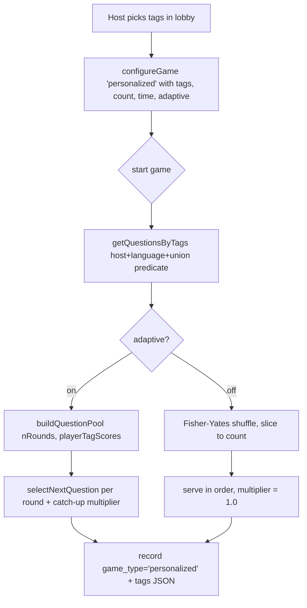

# feat: Personalized (tag-based) game mode

## Summary

Repurpose the TV host's existing multi-set **`custom`** mode into a **`personalized`** mode that selects questions by **tags** instead of question sets. The host picks one or more tags; the game pool is every question carrying **at least one** of those tags (union), scoped to the host and current language. The existing question-count stepper, seconds-per-question stepper, and adaptive toggle are kept as-is. Single-set selection is unaffected — it lives in `configured` mode, which is not touched.

The three resulting lobby modes: **casual** (random mix), **configured** (one authored set / meta-set), **personalized** (tag-filtered mix).

---

## Problem Frame

Today the lobby offers `casual`, `configured`, and `custom`. `custom` lets the host multi-select *question sets* and shuffle them together. The host wants to compose a game by **topic tags** ("play anything tagged `history` or `geography`") rather than by set membership — tags cut across sets, so no single set or multi-set selection expresses the intent. The rarely-used multi-set `custom` mode is the natural slot to repurpose: it already carries the count/time/adaptive controls and the mode-selector plumbing a tag picker needs.

**Scope decision (confirmed with user):** the multi-set-by-set-name capability is dropped, not preserved as a fourth mode. Single-set play remains available via `configured`.

---

## Requirements

- **R1** — The lobby's third mode is labeled **Personalized** and selects by tags, not sets. `casual` and `configured` are unchanged.
- **R2** — Personalized mode shows a multi-select **tag picker**. Each tag shows its available question count. Tags are filtered by the current language and scoped to the host.
- **R3** — A question is in the pool if it carries **at least one** selected tag (union matching).
- **R4** — The question-count stepper, seconds-per-question stepper, and adaptive toggle behave exactly as they did in `custom` mode.
- **R5** — Adaptive ON: tag-aware pool building (`buildQuestionPool` → `selectNextQuestion`) plus position-based catch-up. Adaptive OFF: filtered pool shuffled and sliced to the count, no catch-up.
- **R6** — Start is disabled when no tags are selected.
- **R7** — Works in both **local** (`GameController` + local DB) and **hosted** (`HostedGameController` + Bun server room) paths.
- **R8** — Game results record `game_type = 'personalized'` and the selected tags for analytics.
- **R9** — Tag pool and displayed tag counts use the **same** predicate, so the count a host sees matches what the game loads.
- **R10** — Config persists across `resetGame` (Play Again keeps the chosen tags and settings).

---

## Key Technical Decisions

- **KTD1 — Rename `custom` → `personalized`, don't add a fourth mode.** Every `gameType` reference is a plain `===` string comparison (verified across `room.ts`, `GameController.ts`, `HostedGameController.ts`, `LobbyScreen.tsx`, `gameSlice.ts`) — there is **no exhaustive `switch`** — so the rename is a bounded mechanical retarget with no runtime break. Rationale: user rarely used multi-set; fewer modes is a simpler lobby.
- **KTD2 — Carry `tags: string[]` in place of `questionSetIds`.** The mode's payload/state field changes from set IDs to tag strings. `questionSetIds` on the game config/room becomes unused by this mode (`configured` still uses `questionSetId` singular).
- **KTD3 — Union matching via `json_each`.** New `getQuestionsByTags(db, tags, { hostId, language })` mirrors `getRandomQuestions`' host/language/deleted-set predicate and adds `EXISTS (SELECT 1 FROM json_each(tags) WHERE value IN (…))`. Extends the existing single-tag `getQuestionsByTag` pattern to a tag list.
- **KTD4 — Shared predicate for counts and pool (R9).** `getTagsWithCounts` and `getQuestionsByTags` apply the identical WHERE predicate — host scope, language, exclude soft-deleted sets, exclude `available_in_casual = 0` sets. Excluding casual-hidden sets matches the current `/api/tags` behavior (it counts from `getRandomQuestions`), keeping picker counts honest. See Open Questions for the one judgment call here.
- **KTD5 — Store selected tags in a new `games.tags TEXT` column (migration V18).** JSON array string, mirroring how V12 added `question_set_ids`. The old `question_set_ids` column stays in place (harmless; deferred cleanup). Historical rows with `game_type = 'custom'` are left untouched — they are analytics-only and never fed through an exhaustive switch.
- **KTD6 — Language-filter the tag list.** `GET /api/tags` gains an optional `?language=` param so hosted-mode picker counts match the language-filtered set list already shown in the lobby. Local mode calls the repo helper directly.

---

## High-Level Technical Design

Personalized selection pipeline (both local and hosted share this shape; only the data source differs):

Directional guidance, not implementation spec. The two `adaptive` arms already exist for `custom`; this plan only changes the pool **source** (tags instead of set IDs) and the stored analytics column.

---

## Implementation Units

### U1. DB layer: schema rename, migration, tag queries

**Goal:** Provide the data-layer primitives the rest of the plan builds on.
**Requirements:** R2, R3, R8, R9.
**Dependencies:** none.
**Files:**
- `packages/db/src/schema.ts` — change `GameType` to `'casual' | 'configured' | 'personalized'`.
- `packages/db/src/migrations.ts` — add `MIGRATION_V18` = `ALTER TABLE games ADD COLUMN tags TEXT;` and register `{ version: 18, sql: MIGRATION_V18 }`.
- `packages/db/src/repositories/questions.ts` — add `getQuestionsByTags(db, tags: string[], opts: { hostId: string | null; language?: string })` and `getTagsWithCounts(db, hostId: string | null, language?: string): Promise<{ tag: string; questionCount: number }[]>`.
- `packages/db/src/repositories/questions.test` (existing repo test file, or new `__tests__/questionsByTags.test.ts`).

**Approach:** `getQuestionsByTags` mirrors `getRandomQuestions`' predicate (deleted-set exclusion, `available_in_casual = 0` exclusion, `hostScope(hostId)`, optional `language`) and adds the union clause `EXISTS (SELECT 1 FROM json_each(tags) WHERE json_each.value IN (<placeholders>))`. Empty `tags` returns `[]` without hitting the DB. `getTagsWithCounts` runs the same predicate, then aggregates counts per tag (via `json_each` join or in-JS from a scoped fetch) so its counts equal what `getQuestionsByTags` would load for a single tag.

**Patterns to follow:** `getQuestionsByTag` (`questions.ts:286`) for the `json_each` idiom; `getRandomQuestions` (same file) for `hostScope` + language + deleted/casual-availability clauses.

**Test scenarios:**
- `getQuestionsByTags` with two tags returns the union (a question tagged only `a` and one tagged only `b` both appear; a question tagged both appears once).
- Empty tag list returns `[]` and issues no query.
- Language filter: a `language:'it'` question with a matching tag is excluded when `language:'en'` is passed.
- Host scope: a question in another host's set is excluded; a `set_id IS NULL` question with the tag is included.
- Soft-deleted set and `available_in_casual = 0` set questions are excluded even when tag matches.
- `getTagsWithCounts` count for tag `x` equals `getQuestionsByTags(['x'])`.length under the same host/language.
- Migration V18: on a DB at V17, running migrations yields `user_version = 18` and a `tags` column on `games`.

### U2. Protocol + shared game state retarget

**Goal:** Move the wire/state contract from set IDs to tags for the renamed mode.
**Requirements:** R1, R4, R8.
**Dependencies:** U1 (GameType).
**Files:**
- `packages/ws-protocol/src/messages.ts` — `ConfigureGamePayload.gameType` union → include `'personalized'`, drop `'custom'`; add `tags?: string[]` (used by personalized); keep `totalQuestions`, `questionTimeLimit`, `adaptiveMode`. `GAME_CONFIGURED` payload: carry `tags?: string[]` in place of `questionSetIds`.
- `packages/game-logic/src/slices/gameSlice.ts` — `GameConfig.gameType` union → `'casual' | 'configured' | 'personalized'`; add `tags?: string[]`; the `questionSetIds` field is no longer set by this mode (leave the field or remove if no other reader — verify with a repo search).

**Approach:** Pure type/contract change plus the slice's default/merge handling for `tags`. Confirm `updateConfig`/`resetGame` preserve `tags` the same way they preserved `questionSetIds` (R10).

**Patterns to follow:** how `questionSetIds` and `adaptiveMode` were threaded in the custom-mode change (`gameSlice.ts`, `messages.ts:149-161`).

**Test scenarios:**
- `gameSlice` `updateConfig` with `{ gameType:'personalized', tags:['a','b'] }` stores the tags; a subsequent `resetGame` preserves them (R10).
- Type-level: `ConfigureGamePayload` no longer accepts `'custom'` (compile check / typecheck passes with all call sites updated).

### U3. Server room: personalized branch

**Goal:** Configure, start, and score personalized games on the Bun server.
**Requirements:** R3, R5, R6, R7, R8, R10.
**Dependencies:** U1, U2.
**Files:**
- `apps/server/src/room.ts` — rename the `custom` branches; retarget to tags.
- `packages/db/src/repositories/games.ts` — where the game row is written (`recordGameEnd`/session insert), persist `tags` JSON into the new column instead of `question_set_ids` for this mode.
- `apps/server/src/__tests__/` — extend the room/integration tests that cover custom mode.

**Approach:** Replace the private `questionSetIds` usage for this mode with `selectedTags: string[]`.
- **`configureGame`** (`room.ts:717,759-773`): branch on `gameType === 'personalized'` with non-empty `tags`; validate each tag is a known tag for this host/language (reject unknown/empty); store `selectedTags`, `adaptiveMode` (default true), count, time; respond `GAME_CONFIGURED` with `gameType:'personalized'` + `tags`.
- **`startGame`** (`room.ts:843-881`): load pool via `getQuestionsByTags(this.db, this.selectedTags, { hostId: this.hostId, language: this.language })`. Adaptive ON → `buildQuestionPool(rawPool, { nRounds, playerTagScores })` + `selectNextQuestion` per round. Adaptive OFF → Fisher-Yates shuffle → slice to count. Do **not** shuffle-slice before `buildQuestionPool` when adaptive is on (pool needs headroom).
- **Guards** (`room.ts:843,848,997,1408,1530,1745`): rename `'custom'` → `'personalized'`; keep the `!== 'casual'` / `adaptiveMode` gating logic identical (session/round/stats write for non-casual; tag-score writes + catch-up only when adaptive).
- Persist `this.selectedTags` as JSON to `games.tags`.

**Patterns to follow:** the custom-mode implementation these lines currently hold — logic is unchanged except pool source (tags) and the analytics column.

**Test scenarios:**
- `configureGame('personalized', { tags:['history'], … })` responds `GAME_CONFIGURED` with those tags; an unknown tag is rejected.
- Start with adaptive ON routes questions through `buildQuestionPool`/`selectNextQuestion`; the served pool is a subset of the union pool.
- Start with adaptive OFF serves a shuffled slice of exactly `min(count, poolSize)` questions and applies multiplier 1.0 (no catch-up).
- Empty `tags` at configure time is rejected (R6 server-side guard).
- Game-end writes `game_type='personalized'` and `tags` JSON; tag scores are updated only when adaptive was ON.
- `resetGame` then re-start reuses the same tags (R10).

### U4. Tags API: language filter

**Goal:** Let the hosted lobby fetch a language-scoped tag list with counts.
**Requirements:** R2, R9.
**Dependencies:** U1 (`getTagsWithCounts`).
**Files:**
- `apps/server/src/routes/tags.ts` — `GET /api/tags` accepts optional `?language=`; when present, use `getTagsWithCounts(db, hostId, language)` for counts instead of counting from an unfiltered `getRandomQuestions`.
- `apps/server/src/__tests__/` — tags route test (extend existing tag-scoring integration or add a small route test).

**Approach:** Keep the existing response shape (`{ tags: [{ tag, questionCount, playerCount }], totalPlayers }`) so nothing else breaks; only the `questionCount` source becomes language-aware. `playerCount` handling is unchanged.

**Patterns to follow:** the current `/api/tags` handler and how `?language=` is read in `routes/questionSets.ts`.

**Test scenarios:**
- `GET /api/tags?language=en` returns counts matching `getTagsWithCounts(db, hostId,'en')`.
- `GET /api/tags` with no language keeps prior behavior (no regression).
- Auth: request without a valid session is rejected as before.

### U5. TV controllers + hook

**Goal:** Thread the tag payload through both local and hosted controllers.
**Requirements:** R3, R5, R7, R8, R10.
**Dependencies:** U1, U2.
**Files:**
- `apps/tv-host/src/services/IGameController.ts` — `configureGame` options: `{ tags?: string[]; totalQuestions?; questionTimeLimit?; adaptiveMode? }` (drop `questionSetIds`).
- `apps/tv-host/src/services/GameController.ts` — rename `'custom'` → `'personalized'` (lines `240,244,362,482,786,871,894,1086`); load local pool via `getQuestionsByTags`; keep adaptive/non-adaptive and scoring guards identical; write `tags` on game-end.
- `apps/tv-host/src/services/HostedGameController.ts` — forward `tags` in `CONFIGURE_GAME`; fix the `gameType` cast (`:259`) to include `'personalized'`; handle `tags` in `GAME_CONFIGURED` via `updateConfig`.
- `apps/tv-host/src/hooks/useGameController.ts` — update `configureGame` callback signature to pass `tags`.

**Approach:** Direct mirror of U3 on the local path; hosted path just forwards/receives the new field. Local `getQuestionsByTags` call uses `hostId: null` (local single-host DB) + `currentLanguage`.

**Patterns to follow:** the existing custom-mode branches in these files — same control flow, tag source instead of set IDs.

**Test scenarios:**
- Local `configureGame('personalized', undefined, { tags:['a'], … })` then start loads the union pool from the local DB and respects the adaptive toggle.
- Non-adaptive local game serves a shuffled slice and records `game_type='personalized'` + tags; tag scores untouched.
- Hosted controller forwards `tags` and, on `GAME_CONFIGURED`, stores them via `updateConfig` (no unsafe-cast type error).
- `Test expectation` for the hook change: covered via the controller tests above (thin pass-through).

### U6. TV Lobby UI: Personalized mode + tag picker

**Goal:** Replace the multi-set custom UI with a tag-picker personalized mode.
**Requirements:** R1, R2, R4, R6, R10.
**Dependencies:** U2, U4, U5.
**Files:**
- `apps/tv-host/src/screens/LobbyScreen.tsx` — rename mode (`GameModeType` → `'casual' | 'configured' | 'personalized'`); relabel the button; load tags (local: `getTagsWithCounts`; hosted: `GET /api/tags?language=`) into state; replace the set-card `ScrollView` with a tag-chip multi-select bound to `selectedTags`; keep the count/seconds steppers and adaptive toggle; disable Start when `selectedTags.length === 0`; update D-pad focus graph for the tag chips.
- `packages/i18n/src/locales/en/translation.json` and `it/translation.json` — replace `gameConfig.custom` with `gameConfig.personalized`; add `gameConfig.selectTags`, `gameConfig.selectedTags_one/_other`; keep the existing count/seconds/adaptive keys.

**Approach:** Reuse the custom-mode layout wholesale — the only structural swap is *set cards → tag chips* and the data source that feeds them. Max question count is now the size of the union pool for the selected tags (from the tag counts, de-duplicated is not trivial client-side, so cap at the sum of selected tags' counts as a soft upper bound and let the server/controller clamp to the real pool size — mirror how custom clamped to summed set counts). Load tags on mount and on language change; clear `selectedTags` on language change (parallels the custom set-clear at `LobbyScreen.tsx:222`).

**Patterns to follow:** existing custom-mode UI block (`LobbyScreen.tsx:607+` picker, `529-542` mode button, `449` disabled-hint, `222` language-clear, `336-361` focus refs).

**Test scenarios (E2E, extend `e2e/tv-host/game-mode-persistence.spec.ts`):**
- Selecting Personalized shows the tag picker; picking two tags enables Start.
- Start disabled with zero tags selected (R6).
- Switching language clears selected tags and reloads the picker.
- Play Again after a personalized game returns to the lobby with the same tags/settings (R10).
- `Covers R4.` The count and seconds steppers and adaptive toggle render and function identically to before in personalized mode.

---

## Scope Boundaries

**In scope:** rename `custom` → `personalized`; tag picker + tag pool loading; union matching; analytics column; language-filtered tag list; both local and hosted paths; i18n.

### Deferred to Follow-Up Work
- Remove the now-unused multi-set `getQuestionsBySetIds` and `games.question_set_ids` column (dead after this change; leaving them is harmless).
- Backfill / relabel historical `game_type = 'custom'` rows (analytics-only; not required for correctness).
- Intersection ("all selected tags") matching as an optional toggle.

---

## Open Questions

- **OQ1 — Casual-hidden sets in the tag pool.** KTD4 excludes `available_in_casual = 0` sets from both the tag counts and the pool, matching current `/api/tags` behavior. If a host expects a set they marked "not in casual" to still contribute its tagged questions to an explicit tag selection, flip both `getTagsWithCounts` and `getQuestionsByTags` to include them (keeping the two predicates identical is the invariant, not the specific exclusion). Low-risk to change later; both queries live in one file.

---

## Risks & Dependencies

- **Rename fan-out.** ~7 files reference `'custom'`; all are `===` comparisons (enumerated in Implementation Units with line numbers). Miss one and typecheck catches it — no silent runtime break, and no exhaustive switch exists. Verify with a final `grep -rn "'custom'" apps packages` after the change.
- **Historical rows.** Old `game_type='custom'` rows fall outside the new `GameType` union but are only read for analytics; no exhaustive switch consumes them. Noted, not blocking.
- **Count vs pool drift.** Guarded by KTD4/R9 (shared predicate) and a U1 test asserting equality.

---

## Definition of Done

- Lobby shows casual / configured / **Personalized**; Personalized presents a language-scoped tag picker with counts.
- Selecting tags and starting loads the union pool (host + language scoped), honoring the adaptive toggle, in both local and hosted modes.
- Start is disabled with no tags; config survives Play Again.
- Games record `game_type='personalized'` + selected tags; tag scores update only when adaptive.
- Migration V18 applies cleanly; `yarn lint` and `yarn server typecheck` pass; new/updated unit + E2E tests pass.
- No remaining `'custom'` gameType references outside historical data.

---

## Sources & Research

- Existing custom-mode design: `docs/plans/2026-02-23-feat-custom-game-mode-plan.md` (this plan retargets its file map from sets to tags).
- Single-tag query idiom: `packages/db/src/repositories/questions.ts:286` (`getQuestionsByTag`).
- Host/language/casual predicate to mirror: `getRandomQuestions` (same file).
- Tag listing endpoint: `apps/server/src/routes/tags.ts`.
- Adaptive pipeline: `packages/game-logic/src/utils/questionSelection.ts` (`buildQuestionPool`, `selectNextQuestion`).
- Current mode branches: `apps/server/src/room.ts` and `apps/tv-host/src/services/GameController.ts` / `HostedGameController.ts` (line numbers in units).
